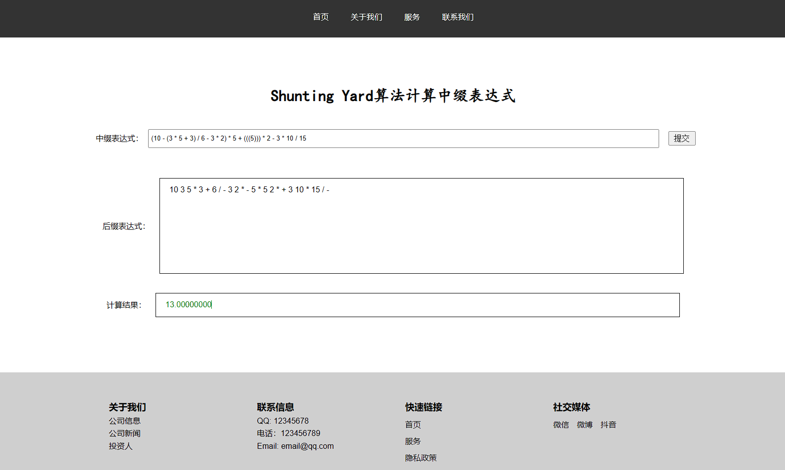
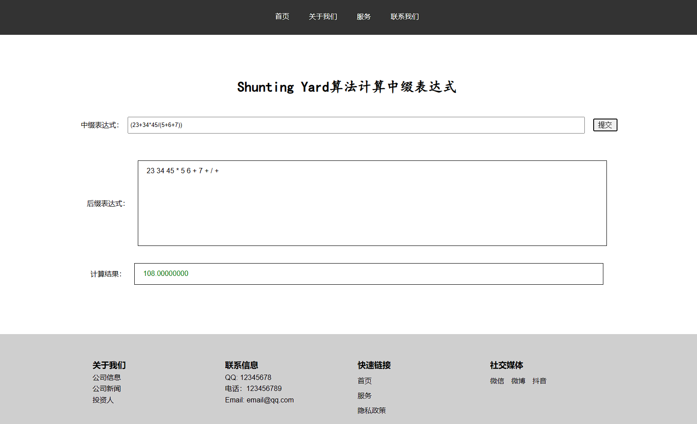
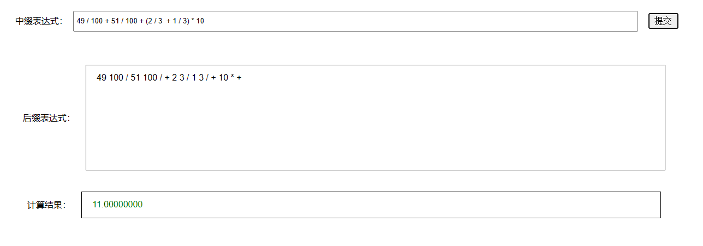

#! https://zhuanlan.zhihu.com/p/698631852

# JSP + Servlet 制作一款中缀表达式计算器

本文分享一个 `jsp` 的小项目，在该项目中运用 `Shunting Yard` 算法实现将中缀表达式转化为后缀表达式，然后通过处理后缀表达式来实现一个支持 `+ - * / ()` 的计算器，不支持负数和浮点数，只支持正整数，计算过程中的结果都以浮点数处理，因此能够精确的计算。

## 项目搭建

在 `eclipse` 创建一个 `Calculator` 的项目，项目结构如下：

```
/Calculator
    └── src/
        └── main/
            ├── java/
            │   └── servlet/
            │       └── CalculatorServlet.java
            └── webapp/
                ├── CSS/
                │   ├── header.css
                │   ├── footer.css
                │   └── index.css
                │
                ├── include/
                │   ├── header.jsp
                │   └── footer.jsp
                │
                ├── WEB-INF/
                │   ├── web.xml            # 配置文件，定义Servlet和过滤器等
                │   ├── classes/           # 编译后的Java类文件
                │   │   └── servlet/
                │   │       └── CalculatorServlet.class
                │   │
                │   └── lib/               # 项目依赖的JAR文件
                │
                └──index.jsp               # 项目入口文件
```

`index.jsp` 文件如下：

```html
<!DOCTYPE html>
<html>

<body>

    <head>
        <meta charset="UTF-8">
        <meta name="viewport" content="width=device-width, initial-scale=1.0">
        <title>首页</title>
        <link rel="stylesheet" type="text/css" href="css/index.css">
        <link rel="stylesheet" type="text/css" href="css/header.css">
        <link rel="stylesheet" type="text/css" href="css/footer.css">
        <script src="https://code.jquery.com/jquery-3.6.0.min.js"></script>
        <script>
            $(document).ready(function () {
                $('.infix-form').submit(function (e) {
                    e.preventDefault(); // 阻止表单默认提交行为
                    var expression = $('#input').val(); // 获取输入的表达式
                    $.ajax({
                        url: '/Calculator/CalculatorServlet', // Servlet的URL
                        type: 'POST',
                        data: { expression: expression }, // 发送的数据
                        dataType: 'json', //服务器数据响应类型
                        success: function (response) { // 请求成功后的回调函数
                            $('#postfix').text(response.postfix);
                            var res_value = response.res_value;
                            if (res_value === "error")
                                $('#res_value').html('<p style="color: red;">错误: 无法计算表达式</p>'); // 错误处理
                            else
                                $('#res_value').html('<p style="color: green;">' + response.res_value + "</p>");

                            console.log(response.postfix);
                            console.log(expression + " = " + res_value);
                        },
                        error: function () {
                            $('#res').html('<p style="color: red;">服务器遇到错误</p>'); // 错误处理
                        }
                    });
                });
            });
        </script>
    </head>

    <%@ include file="include/header.jsp" %>

        <div id="calc">
            <h1>Shunting Yard算法计算中缀表达式</h1>
            <form class="infix-form" action="/Calculator/CalculatorServlet" method="POST">
                <div class="infix">
                    <span>中缀表达式：</span>
                    <input type="text" id="input" name="expression" placeholder="请输入计算式，支持 + - * / () 的运算，不支持浮点数和负数">
                    <input type="submit">
                </div>
            </form>
            <div class="res">
                <span>后缀表达式：</span>
                <div id="postfix"></div>
            </div>
            <div class="res">
                <span>计算结果：</span>
                <div id="res_value"></div>
            </div>
        </div>

        <%@ include file="include/footer.jsp" %>
</body>

</html>
```


`header.jsp` 如下：

```html
<%@ page pageEncoding="UTF-8" contentType="text/html; charset=UTF-8" %>

<header>
    <nav class="navbar">
        <ul>
            <li><a href="#home">首页</a></li>
            <li><a href="#about">关于我们</a></li>
            <li><a href="#services">服务</a></li>
            <li><a href="#contact">联系我们</a></li>
        </ul>
    </nav>
</header>
```

`footer.jsp` 如下：

```html
<%@ page pageEncoding="UTF-8" contentType="text/html; charset=UTF-8" %>

<footer class="footer">
    <div class="container">
        <div class="row">
            <div class="col">
                <h3>关于我们</h3>
                <p>公司信息</p>
                <p>公司新闻</p>
                <p>投资人</p>
            </div>
            <div class="col">
                <h3>联系信息</h3>
                <p>QQ: 12345678</p>
                <p>电话：123456789</p>
                <p>Email: email@qq.com</p>
            </div>
            <div class="col">
                <h3>快速链接</h3>
                <ul>
                    <li><a href="#">首页</a></li>
                    <li><a href="#">服务</a></li>
                    <li><a href="#">隐私政策</a></li>
                </ul>
            </div>
            <div class="col social">
                <h3>社交媒体</h3>
                <ul>
                    <li><a href="#">微信</a></li>
                    <li><a href="#">微博</a></li>
                    <li><a href="#">抖音</a></li>
                </ul>
            </div>
        </div>
        <hr>
        <p class="copyright">&copy; 2023 我的网站. 版权所有.</p>
    </div>
</footer>
```

`index.css` 如下：

```css
* {
    margin: 0;
    padding: 0;
    box-sizing: border-box;
}

#calc {
    margin: 5vh auto;
    width: 80%;
    height: 60vh;
    display: flex;
    justify-content: center;
    align-items: center;
    flex-direction: column;
}

#calc h1 {
    font-family: Kaiti;
}

#calc form {
    width: 100%;
    padding: 2vh;
}

.infix {
    display: flex;
    justify-content: center;
    align-items: center;
    margin: 2vh 0;
}

.infix span {
    font-size: 1em;
    padding: 1vh;
}

.infix input[type='text'] {
    padding: 0.5vw 0.5vh;
    width: 70%;
}

.infix input[type='submit'] {
    font-family: 'Courier New', Courier, monospace;
    font-size: 1em;
    padding: 0.25vh 0.5vw;
    margin-left: 1vw;
}

.res {
    width: 100%;
    margin: 2vh;
    display: flex;
    justify-content: center;
    align-items: center;
}

.res span {
    margin-right: 1vw;
}

#postfix,
#res_value {
    border: 1px solid black;
    width: 70%;
    padding: 1vh 1vw;
    word-wrap: break-word;
}

#postfix {
    height: 20vh;
    overflow-y: auto;
}

#res_value {
    height: 5vh;
}
```

`header.css` 如下：

```css
@charset "UTF-8";

/* 页眉样式 */
header {
    background: #333; /* 深色背景 */
    color: #ffffff;
    padding: 1rem 0;
    text-align: center;
}

/* 导航栏样式 */
.navbar {
    list-style: none;
    overflow: hidden;
}

.navbar li {
    display: inline; /* 使列表项水平排列 */
}

.navbar li a {
    display: inline-block;
    color: #fff; /* 文本颜色 */
    text-decoration: none;
    padding: 0.75rem 1.25rem; /* 上下0.75rem，左右1.25rem的内边距 */
}

.navbar li a:hover,
.navbar li a:focus {
    background-color: #666; /* 鼠标悬停或聚焦时的背景颜色 */
    border: 0.1px solid #333;
    border-radius: 1em;
}

/* 响应式设计 */
@media (max-width: 768px) {
    .navbar li {
        display: block;
        width: 100%;
    }

    .navbar li a {
        text-align: center; /* 在小屏幕上使链接文本居中 */
        padding: 1rem;
    }
}
```

`footer.css` 如下：

```css
@charset "UTF-8";

a {
    text-decoration: none;
    color: #333;
}

a:hover{
    text-decoration: underline;
    font-weight: bold;
}

.footer {
    background-color: #cfcfcf;
    padding: 2rem 0;
}

.container {
    width: 80%;
    margin: auto;
    max-width: 1200px;
}

.row {
    display: flex;
    flex-wrap: wrap;
}

.col {
    flex: 1;
    margin: 0.5rem;
    padding: 1rem;
}

.col ul{
    margin-left: 0;
    padding-left: 0;
}

.col li{
    list-style: none;
    margin: 0.5rem 0;
}

.col li a {
  display: inline-block;
  text-align: left;
}

.copyright {
    text-align: center;
    margin-top: 1rem;
}

.social ul {
    display: flex;
    justify-content: start;
    list-style: none;
}

.social li {
    margin-right: 1rem;
}

/* 响应式设计 */
@media (max-width: 768px) {
    .container {
        width: 90%;
    }
    .row {
        flex-direction: column;
    }
    .col {
        margin: 1rem 0;
    }
}
```

最重要的是 `servlet` 部分，`CalculatorServlet.java` 如下：

```java
package servlet;

import java.io.IOException;
import java.io.PrintWriter;
import java.util.ArrayList;
import java.util.HashMap;
import java.util.Map;
import java.util.Stack;
import java.util.stream.Collectors;

import jakarta.servlet.ServletException;
import jakarta.servlet.http.HttpServlet;
import jakarta.servlet.http.HttpServletRequest;
import jakarta.servlet.http.HttpServletResponse;

public class CalculatorServlet extends HttpServlet {
    private static final long serialVersionUID = 1L;

    public void doGet(HttpServletRequest request, HttpServletResponse response) throws ServletException, IOException {
        doPost(request, response);
    }

    public void doPost(HttpServletRequest request, HttpServletResponse response) throws ServletException, IOException {
        // 设置内容类型为 JSON
        response.setContentType("application/json");
        response.setCharacterEncoding("UTF-8");

        // 获取表达式参数
        String expression = request.getParameter("expression");

        // 计算
        ArrayList<Object> POSTFIX = infixToPostfix(expression);
        System.out.println(POSTFIX);
        Double res = eval(POSTFIX);

        // 响应
        PrintWriter out = response.getWriter();

        String postfix, res_value;// 创建数据
        postfix = POSTFIX.stream()
                .map(Object::toString) // 转换为字符串
                .collect(Collectors.joining(" ")); // ", " 是分隔符
        if (res != null)
            res_value = String.format("%.8f", res);
        else
            res_value = "error";

        String jsonResponse = String.format("{\"postfix\":\"%s\",\"res_value\":\"%s\"}", postfix, res_value);// 手动构建JSON字符串

        out.print(jsonResponse);
        out.flush(); // 确保响应被发送
        System.out.printf("%s = %s\n", expression, res_value);
    }

    /* 根据逆波兰表达式求解 */
    private static Map<Character, Integer> opLevel = new HashMap<Character, Integer>();
    static {
        opLevel.put('(', 0);
        opLevel.put('+', 1);
        opLevel.put('-', 1);
        opLevel.put('*', 2);
        opLevel.put('/', 2);
    }

    // op1 <= op2 返回 true, 否则返回 false
    private static boolean compareLevel(char op1, char op2) {
        int level1 = opLevel.get(op1);
        int level2 = opLevel.get(op2);
        return level1 <= level2;
    }

    /* Shunting Yard算法求解逆波兰表达式 */
    private static ArrayList<Object> infixToPostfix(String infix) {
        Stack<Character> stk = new Stack<Character>();
        ArrayList<Object> postfix = new ArrayList<Object>();

        infix = infix.replaceAll("\\s+", "");// 去除字符串中的所有空字符

        try {
            for (int i = 0; i < infix.length(); i++) {
                char ch = infix.charAt(i);

                if (ch >= '0' && ch <= '9') {
                    int v = 0;
                    while (ch >= '0' && ch <= '9') {
                        v = v * 10 + ch - '0';
                        i++;
                        if (i >= infix.length())
                            break;
                        ch = infix.charAt(i);
                    }
                    i--;// 回退到非数字的字符上
                    postfix.add(v);// 添加数值
                } else if (ch == '(') {
                    stk.push(ch);
                } else if (ch == '+' || ch == '-' || ch == '*' || ch == '/') {
                    while (!stk.isEmpty() && compareLevel(ch, stk.peek())) {// 栈不为空且ch的优先级小于等于栈顶元素
                        postfix.add(stk.pop());
                    }
                    stk.push(ch);
                } else if (ch == ')') {
                    while (!stk.isEmpty() && stk.peek() != '(') {
                        postfix.add(stk.pop());
                    }
                    stk.pop();// 弹出左括号
                }
            }

            // 处理栈中剩余的符号
            while (!stk.isEmpty()) {
                postfix.add(stk.pop());
            }
        } catch (Exception ex) {
            ex.printStackTrace();
        }

        return postfix;
    }

    public static Double eval(ArrayList<Object> postfix) {
        Stack<Double> values = new Stack<Double>();

        try {
            for (int i = 0; i < postfix.size(); i++) {
                Object e = postfix.get(i);
                if (e instanceof Integer) {
                    int v = (int) e;
                    double value = v;
                    values.push(value);
                } else if (e instanceof Character) {
                    // 弹出两个操作数
                    double value1, value2;
                    if (!values.isEmpty())
                        value2 = values.pop();
                    else
                        break;
                    if (!values.isEmpty())
                        value1 = values.pop();
                    else
                        break;

                    char op = (Character) e;
                    double res = 0;
                    switch (op) {
                        case '+':
                            res = value1 + value2;
                            break;
                        case '-':
                            res = value1 - value2;
                            break;
                        case '*':
                            res = value1 * value2;
                            break;
                        case '/':
                            if (value2 != 0)
                                res = value1 / value2;
                            else {
                                System.out.printf("%lf / %lf 中除数为0\n", value1, value2);
                                return null;
                            }
                            break;
                    }
                    values.push(res);
                }
            }
        } catch (Exception ex) {
            ex.printStackTrace();
        }

        if (values.isEmpty())
            return null;// 无法计算

        double res = values.pop();

        return res;
    }
}
```

`web.xml` 如下：

```xml
<?xml version="1.0" encoding="UTF-8"?>
<web-app xmlns:xsi="http://www.w3.org/2001/XMLSchema-instance" xmlns="http://xmlns.jcp.org/xml/ns/javaee" xmlns:jsp="http://java.sun.com/xml/ns/javaee/jsp" xsi:schemaLocation="http://xmlns.jcp.org/xml/ns/javaee http://xmlns.jcp.org/xml/ns/javaee/web-app_4_0.xsd" version="4.0">
  <jsp-config>
    <jsp-property-group>
      <description>Configures the JSP engine settings for all JSP pages.</description>
      <url-pattern>*.jsp</url-pattern>
      <el-ignored>true</el-ignored>
      <page-encoding>UTF-8</page-encoding>
      <scripting-invalid>true</scripting-invalid>
      <trim-directive-whitespaces>true</trim-directive-whitespaces>
      <default-content-type>text/html</default-content-type>
    </jsp-property-group>
    <jsp-property-group>
      <description>Property group for index.jsp only</description>
      <url-pattern>/index.jsp</url-pattern>
    </jsp-property-group>
  </jsp-config>
  
  <!-- servlet配置 -->
  <servlet>
    <description></description>
    <display-name>CalculatorServlet</display-name>
    <servlet-name>CalculatorServlet</servlet-name>
    <servlet-class>servlet.CalculatorServlet</servlet-class>
  </servlet>
  <servlet-mapping>
    <servlet-name>CalculatorServlet</servlet-name>
    <url-pattern>/CalculatorServlet</url-pattern>
  </servlet-mapping>
</web-app>
```

## 实现效果展示







在浏览器的控制台和 `eclipse` 的控制台中都可以看到运行的数据记录。