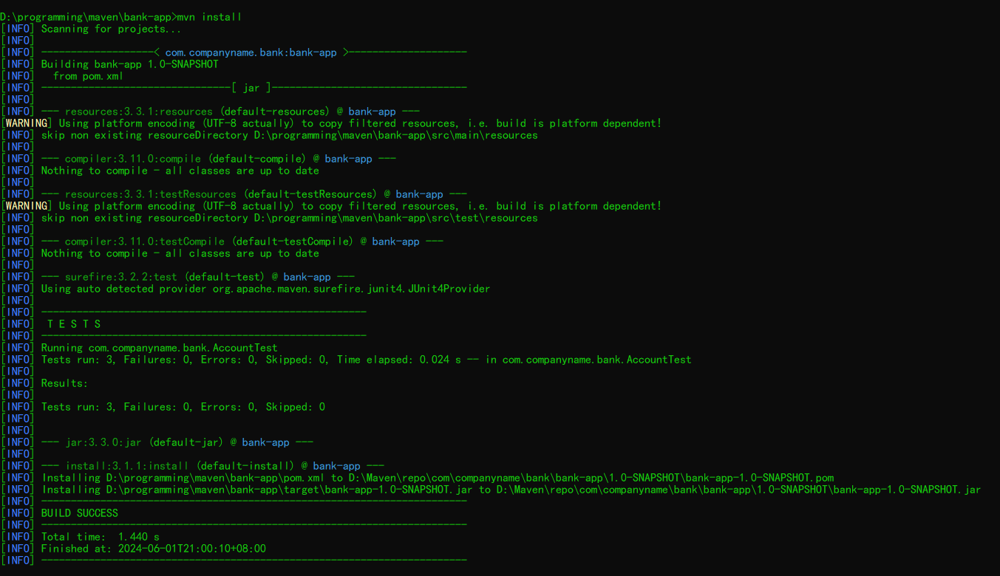
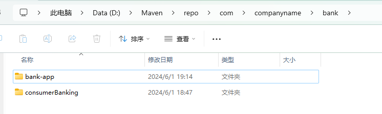

#! https://zhuanlan.zhihu.com/p/701130908
# Maven 基础教程

`Maven` 是一个强大的 `Java` 项目管理和构建自动化工具。

## 下载 Maven

[Apache Maven 官网下载](https://maven.apache.org/download.cgi)

下载完 `Maven` 压缩包将其解压到 `D:\Maven`

## 配置环境变量

创建两个新的环境变量，如果是用户变量则只对用户有效，如果是系统变量则对所有用户有效。

```text
变量            路径
M2_HOME         D:\Maven\apache-maven-3.9.6\bin
MAVEN_HOME      D:\Maven\apache-maven-3.9.6
```

在 `PATH` 变量中添加以下内容，无论是用户变量还是系统变量里的 `PATH` 都行：

```text
%MAVEN_HOME%\bin
```

## 验证安装

`win + r`，输入 `cmd`，输入 `mvn --version`验证。

## 配置 Maven

### 更改本地仓库

编辑 `D:\Maven\apache-maven-3.9.6\conf\settings.xml`，在 `D:\Maven` 创建 `repo` 文件夹用作本地仓库，更改本地仓库如下：

```xml
<localRepository>D:\Maven\repo</localRepository>
```

### 配置镜像

```xml
<mirrors>
    <mirror>
      <!--默认镜像-->
        <id>maven-default-http-blocker</id>
        <mirrorOf>external:http:*</mirrorOf>
        <name>Pseudo repository to mirror external repositories initially using HTTP.</name>
        <url>http://0.0.0.0/</url>
        <blocked>true</blocked>
      </mirror>  

      <!-- 阿里云镜像 -->
      <mirror>
        <id>aliyunmaven</id>
        <mirrorOf>central</mirrorOf>
        <name>阿里云公共仓库</name>
        <url>https://maven.aliyun.com/repository/public</url>
      </mirror>
      
      <!-- 清华大学镜像 -->
      <mirror>
        <id>tuna</id>
        <mirrorOf>central</mirrorOf>
        <name>清华大学</name>
        <url>https://mirrors.tuna.tsinghua.edu.cn/maven/repository</url>
      </mirror>
      
      <!-- 中科大镜像 -->
      <mirror>
        <id>ustc</id>
        <mirrorOf>central</mirrorOf>
        <name>中国科学技术大学</name>
        <url>https://mirrors.ustc.edu.cn/maven/</url>
      </mirror>
      
      <!-- 豆瓣镜像 -->
      <mirror>
        <id>douban</id>
        <mirrorOf>central</mirrorOf>
        <name>豆瓣</name>
        <url>https://maven.douban.com/</url>
      </mirror>
      
      <!-- 华为云镜像 -->
      <mirror>
        <id>huaweicloud</id>
        <mirrorOf>central</mirrorOf>
        <name>华为云</name>
        <url>https://repo.huaweicloud.com/repository/maven/</url>
      </mirror>
      
      <!-- 亚马逊AWS镜像 -->
      <mirror>
        <id>aws</id>
        <mirrorOf>central</mirrorOf>
        <name>亚马逊AWS</name>
        <url>https://maven-central-repo-us-east-1.elasticbeanstalk.com/</url>
      </mirror>
      
      <!-- Google镜像 -->
      <mirror>
        <id>google</id>
        <mirrorOf>central</mirrorOf>
        <name>Google</name>
        <url>https://maven-central.storage-download.googleapis.com/repos/central/</url>
      </mirror>
</mirrors>
```

## 创建 Maven 项目

### 创建项目

```dos
mvn archetype:generate -DgroupId=com.mycompany.app -DartifactId=my-app -DarchetypeArtifactId=maven-archetype-quickstart -DinteractiveMode=false
```

此命令使用 `archetype:generate` 目标来生成一个新的 Maven 项目  

`-D` 指定一个属性用于定义或修改 `Maven` 构建过程中的设置。

`groupID` 和 `artifactId` 被统称为坐标，为了保证项目唯一性而提出，在 `Maven` 仓库中通过这两个 `id` 查找项目。

`groupID` 为 `Maven` 项目坐标中的第一部分，第一段是域名,第二段为公司名称或者团队名称。域又分为 `org`、`com`、`cn` 等等。其中 `org` 为非盈利组织，`com` 为商业组织。

`artifactId` 为 `Maven` 项目坐标的第二部分，用于标识项目中的构件，它是 `groupID` 下的特定项目的唯一标识。

`archetypeArtifactId` 指定要使用的 `Maven` 原型(archetype) 的ID，原型是一个 `Maven` 项目模板，包含项目的初始结构和配置。

`interactiveMode` 控制 Maven 是否以交互模式运行。在交互模式下，Maven 会提示用户输入一些信息（如项目名称、描述等）。

### 进入项目根目录

```cmd
cd my-app
```

### 查看项目结构

```text
>> tree
my-app/
    ├── pom.xml
    └─src
        ├─main
        │  └─java
        │      └─com
        │          └─mycompany
        │              └─app
        └─test
            └─java
                └─com
                    └─mycompany
                        └─app
```

## 依赖管理

在 `pom.xml` 的 `<project>...</project>` 中添加所需依赖，例如添加 `Junit` 依赖:

```xml
<dependencies>
    <dependency>
        <groupId>junit</groupId>
        <artifactId>junit</artifactId>
        <version>4.13.2</version>
        <scope>test</scope>
    </dependency>
</dependencies>
```

`scope` 指定依赖的范围：

| scope取值    |   有效范围          | 依赖传递 |
| :---------: | :-----------------: | :------: |
|   compile   |    all              |    是    |
|   provided  |    compile,test     |    否    |
|   runtime   |    runtime,test     |    是    |
|   test      |    test             |    否    |
|   system    |    compile,test     |    是    |

> `system` 和 `provided` 的区别是，使用 `system` 范围的依赖时必须通过 `systemPath` 元素显式地指定依赖文件的路径。由于此类依赖不是通过Maven仓库解析的，而且往往与本机系统绑定，可能造成构建的不可移植，因此应该谨慎使用。

## 应用程序

在 `/src/main/java` 中编写程序：

`Account.java`

```java
package com.companyname.bank;

public class Account {
    private double balance;

    //构造函数
    public Account(double initialBalance) {
        this.balance = initialBalance;
    }

    //存款
    public void deposit(double amount) {
        balance += amount;
    }

    //撤回
    public void withdraw(double amount) {
        if (amount <= balance) {
            balance -= amount;
        } else {
            throw new IllegalArgumentException("Insufficient funds");
        }
    }

    public double getBalance() {
        return balance;
    }
}
```

`App.java`

```Java
package com.companyname.bank;

public class App {
    public static void main(String[] args) {
        System.out.println("Welcome to the Bank App!");

        // 创建一个银行账户并进行操作
        Account account = new Account(1000); // 假设初始余额为1000
        account.deposit(500); // 存入500
        System.out.println("Balance after deposit: " + account.getBalance());

        try {
            account.withdraw(200); // 取出200
            System.out.println("Balance after withdrawal: " + account.getBalance());
        } catch (IllegalArgumentException e) {
            System.out.println("Withdrawal failed: " + e.getMessage());
        }
    }
}
```

## 测试代码

`Maven` 项目一般使用 `Junit` 进行单元测试。

```Java
package com.companyname.bank;

import junit.framework.TestCase;

public class AccountTest extends TestCase {
    public void testDeposit() {
        Account account = new Account(100);
        account.deposit(50);
        assertEquals("The balance should be 150 after depositing 50", 150, account.getBalance(), 0.01);
    }

    public void testWithdraw() {
        Account account = new Account(100);
        account.withdraw(30);
        assertEquals("The balance should be 70 after withdrawing 30", 70, account.getBalance(), 0.01);
    }

    public void testWithdrawInsufficientFunds() {
        Account account = new Account(100);
        boolean hadException = false;
        try {
            account.withdraw(200);
        } catch (IllegalArgumentException e) {
            hadException = true;
        }
        assertTrue("Should have thrown an exception for insufficient funds", hadException);
    }
}
```

`assertEquals(message,expected_value, actual_value, delta)` 是 `JUnit` 测试框架中的一个断言方法，用于验证测试的预期结果是否与实际结果相匹配。如果两者不匹配，测试将被认为是失败的。

`assertEquals()` 参数依次是：字符串消息、期望值、实际值、容差值

`JUnit` 提供多种断言方法，用于不同方面的单元测试验证。例如：

1. 基础断言
    - `assertTrue`: 验证一个条件是否为 true。
    - `assertFalse`: 验证一个条件是否为 false。
2. 比较断言
    - `assertEquals`: 检查两个值是否相等。
    - `assertNotEquals`: 检查两个值是否不相等。
3. 异常断言
    - `assertThrows`: 验证某个方法调用是否抛出了指定类型的异常（JUnit 5 专有）。
4. 浮点数比较
    - `assertEquals (带有 delta 参数)`: 用于比较两个浮点数是否足够接近（即在某个 delta 范围内相等）。
5. 对象比较
    - `assertNotNull`: 验证一个对象不是 null。
    - `assertNull`: 验证一个对象是 null。
    - `assertSame`: 检查两个引用是否指向同一个对象。
    - `assertNotSame`: 检查两个引用是否指向不同的对象。
6. 集合断言
    - `assertArrayEquals`: 检查两个数组是否相等。
7. 字符串断言
    - `assertStringContains`: 检查一个字符串是否包含另一个字符串。
8. 时间断言
    - `assertTimes`: 检查两个时间/日期对象是否相等（需要额外的库，如 JUnit-Testing）。
9. 条件失败
    - `fail`: 手动标记一个测试为失败。

## 构建项目

- 编译项目

```cmd
mvn compile
```

- 运行测试

```cmd
mvn test
```

- 打包

```cmd
mvn package
```

默认将会在 `my-app/target` 中生成整个项目打包后的 `jar` 包。打包类型由 `pom.xml` 文件中的 `<packaging>` 元素指定。

- 安装到本地仓库

```cmd
mvn install
```

运行此命令将进行一系列操作，编译项目->运行测试->打包->安装到本地仓库->生成项目信息。安装的位置为 `maven` 的 `config/settings.xml` 的 `<localRepository>` 元素指定。





很神奇的是我们只有 `bank-app`，但实际上还生成了 `consumerBanking`，这是因为 `Maven` 会在多模块项目（一个父项目下有多个子模块）中为每个模块执行构建生命周期。如果 `bank-app` 是一个多模块项目的父模块，而 `consumerBanking` 是它的一个子模块，那么执行 `mvn install` 会在以下情况下生成这两个构件：

1. 多模块项目结构：在 `Maven` 中，一个父 `pom.xml` 文件可以包含多个 `<module>` 标签，每个标签定义了一个子模块的路径。`Maven` 会递归地构建所有这些模块。

2. 父 `pom.xml` 配置：如果 `bank-app` 项目的 `pom.xml` 文件中包含了对 `consumerBanking` 模块的引用，`Maven` 会识别这个结构并相应地构建每个模块。

```xml
<modules>
  <module>consumerBanking</module> <!-- 引用子模块 -->
</modules>
```

如果你只希望构建 bank-app 而不构建 consumerBanking，你可以使用 `-pl`（--projects）选项指定要构建的项目：

```cmd
mvn install -pl bank-app
```

或者，如果你想构建整个项目但不包括特定的模块，可以使用 `-am`（--also-make）和 `-pl` 选项：

```cmd
mvn install -am -pl !consumerBanking
```

## 运行项目

如果项目是一个 `Java` 应用程序，并且包含一个 `main` 方法，可以用以下命令运行：

```cmd
java -cp target/my-app-1.0-SNAPSHOT.jar com.mycompany.app.App
```

## 其他 Maven 命令

- 清理：`mvn clean` 清除 `target` 目录
- 生成项目信息：`mvn site` 生成项目文档和报告
- 更新项目依赖：`mvn dependency:tree` 查看项目的依赖树

## 报错处理

当运行 `mvn` 命令时可能遇到报错，例如：

```text
[ERROR] Plugin org.apache.maven.plugins:maven-resources-plugin:3.3.1 or one of its dependencies could not be resolved: Failed to read artifact descriptor for org.apache.maven.plugins:maven-resources-plugin:jar:3.3.1: 1 problem was encountered while building the effective model
[ERROR] [FATAL] Non-parseable POM D:\Maven\repo\org\apache\maven\plugins\maven-resources-plugin\3.3.1\maven-resources-plugin-3.3.1.pom: unexpected markup <!d (position: START_DOCUMENT seen \r\n<!d... @2:4)  @ line 2, column 4
[ERROR] -> [Help 1]
[ERROR]
[ERROR] To see the full stack trace of the errors, re-run Maven with the -e switch.
[ERROR] Re-run Maven using the -X switch to enable full debug logging.
[ERROR]
[ERROR] For more information about the errors and possible solutions, please read the following articles:
[ERROR] [Help 1] http://cwiki.apache.org/confluence/display/MAVEN/PluginResolutionException  
```

一个基本的解决办法是将报错中提到的相关资源删除，因为这些资源由于下载中断等等原因出现了损坏，因此需要删除这些损坏的资源，然后再重新输入命令。

上例中 `D:\Maven\repo\org\apache\maven\plugins\maven-resources-plugin\3.3.1` 出现损坏，将其删除后再重新输入命令就可以正常运行。

以上就是关于 `Maven` 的全面内容，相信你已经对 `Maven` 有了基本的了解。