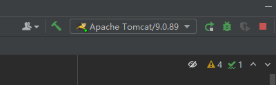
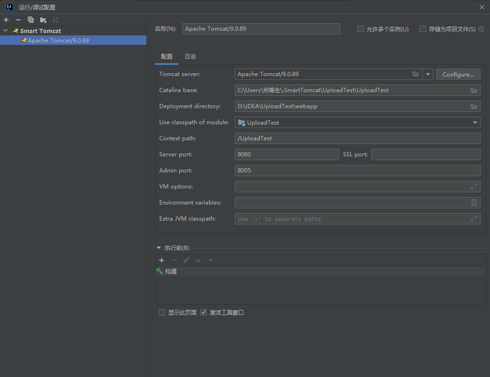
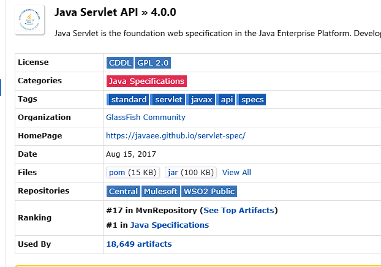
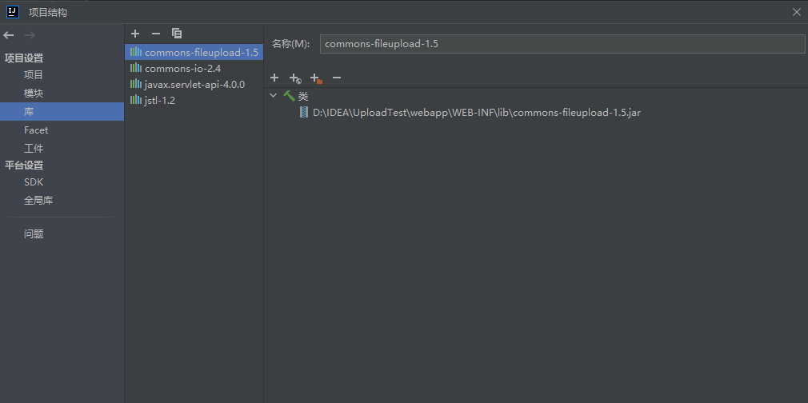

#! https://zhuanlan.zhihu.com/p/697951970

# Servlet学习 - 文件上传

本文介绍在不使用 Maven、Gradle 等包管理工具的情况下搭建一个实现文件上传的服务器。由于在菜鸟教程学习 `servlet` 的文件上传时遇到很多问题，因此编写此教程。

工具：IDEA社区版、Tomcat

> 注：IDEA的下载以及JDK 的下载和配置都不在此教程范围内。

## Tomcat下载

根据我的踩坑经历，建议下载 `Tomcat 9`。从 `Tomcat 9` 以下的 `Servlet API` 标准包都是 `javax.servlet`，而 从 `Tomcat 10` 以上的 `Servlet API` 标准包都是 `jakarta.servlet`，这将导致一些兼容性问题。出于使用最新的 `Tomcat` 想法，我尝试了 `Tomcat 10` 发现还是得使用 `Tomcat 9` 来写文件上传的 `Servlet`，`Tomcat 10` 巨坑，我尝试了几天解决兼容性问题仍然无果。

> oracle在19年把javax捐给eclipse基金会，但不允许使用javax的命名空间，所以eclipse才继续发展成现在的javaee标准Jakarta。  
在Java EE 8之前，javax.servlet包是Servlet API的标准包。然而，由于Oracle和Java社区的一些变化，这个包的发展在Java EE 8之后停滞不前。  
为了保持Servlet技术的发展，Java社区创建了一个新的开源项目，即Jakarta EE。为了能够继续发展，原始的javax.servlet包已经迁移到了jakarta.servlet包。新的jakarta.servlet包是javax.servlet包的完全向后兼容的替代品，它包含了所有原始包中的类和接口。

[下载 Tomcat 9 Core.zip 版本](https://tomcat.apache.org/download-90.cgi)

> **Core版本和Develop版本的区别**  
> Core：是Tomcat正式的二进制发布版本，一般大家做开发或者学习的时候应该下载Core版本。  
> Deployer：是基于Tomcat的web应用的发布器，在把写好的JavaEE应用发布到Tomcat的时候可以使用Deployer来动态的发布。所以它不是真正的Tomcat二进制版本，它只是一个用以发布基于Tomcat的Web应用的发布工具而已。因此，大家在下载的时候不应该下载这个东西，除非想动态的发布Web应用到Tomcat中去。  

如果下载速度慢，可以尝试区下面的镜像站下载：

[Tomcat 清华镜像](https://mirrors.tuna.tsinghua.edu.cn/apache/tomcat/)

[Tomcat 阿里镜像](https://mirrors.aliyun.com/apache/tomcat/)

下载完解压到D盘即可，在此项目中无需配置 `Tomcat` 的环境变量，当然最好配置一下，可以自行上网查找如何配置。也可以下载多个 `Tomcat` 版本，然后在运行配置里配置不同的 `Tomcat` 进行不同的运行。例如我最开始使用的是 `Tomcat 10` 学习 `servlet`，然后遇到问题只能再下载一个 `Tomcat 9` 重新创建项目学习 `servlet` 的文件上传。因此多个 `Tomcat` 也是可以的。

## 搭建项目

在IDEA中创建一个Java项目(不需要选择Maven或者Gradle的构建系统，直接默认)。

基于学习的目的，我们不使用Maven或者Gradle这样的包管理工具。

以创建的项目 `UploadTest` 为例，在项目中创建这样的文件结构：

```
UploadTest/
    ├── src/
    │   └── main/
    │       ├── java/              # 存储servlet的java源码
    │       └── resources/
    └── webapp/
        ├── WEB-INF/
        │   ├── web.xml            # 配置文件，定义Servlet和过滤器等
        │   ├── classes/           # 编译后的Java类文件
        │   └──  lib/               # 项目依赖的JAR文件
        │       └── yourlib.jar
        │
        └── index.jsp               # 网站的入口页面
```

代码参考的是菜鸟教程：[Servlet实现文件上传](https://www.runoob.com/servlet/servlet-file-uploading.html)，下面的 `ServletUpload.java` 在此基础上进行了简化和注释，方便学习和理解。


`web.xml`，如果有需要可以自行配置。

```xml
<?xml version="1.0" encoding="UTF-8"?>
<web-app id="WebApp_ID" version="4.0"
         xmlns="http://xmlns.jcp.org/xml/ns/javaee"
         xmlns:xsi="http://www.w3.org/2001/XMLSchema-instance"
         xsi:schemaLocation="http://xmlns.jcp.org/xml/ns/javaee
                http://xmlns.jcp.org/xml/ns/javaee/web-app_4_0.xsd">

    <!-- jsp 配置 -->
    <jsp-config>
        <jsp-property-group>
            <description>JSP Configuration for index.jsp</description>
            <display-name>index.jsp</display-name>
            <url-pattern>/index.jsp</url-pattern>
            <page-encoding>UTF-8</page-encoding>
        </jsp-property-group>
    </jsp-config>

</web-app>
```


`index.jsp` 创建一个上传文件的表单：

```html
<html>

<head>
    <meta http-equiv="Content-Type" content="text/html; charset=UTF-8">
    <title>文件上传实例</title>
</head>

<body>
    <h1>文件上传实例</h1>
    <form method="post" action="/UploadTest/Upload" enctype="multipart/form-data" id="uploadForm">
        选择一个文件:
        <input type="file" name="file[]" multiple="multiple" />
        <br /><br />
        <input type="submit" value="上传" />
    </form>
</body>

</html>
```

在 `UploadTest/src/main/java/com/servlet` 中创建 `UploadServlet.java`

```Java
package com.servlet;

import org.apache.commons.fileupload.FileItem;
import org.apache.commons.fileupload.disk.DiskFileItemFactory;
import org.apache.commons.fileupload.servlet.ServletFileUpload;

import javax.servlet.ServletException;
import javax.servlet.annotation.WebServlet;
import javax.servlet.http.HttpServlet;
import javax.servlet.http.HttpServletRequest;
import javax.servlet.http.HttpServletResponse;
import java.io.File;
import java.io.IOException;
import java.io.PrintWriter;
import java.util.List;

@WebServlet("/Upload")
public class UploadServlet extends HttpServlet {
    private static final long serialVersionUID = 1L;//serialVersionUID是一个唯一的版本标识符，用于对象序列化机制。

    //上传文件的存储目录
    private static final String UPLOAD_DIRECTORY = "upload";

    // 上传配置
    private static final int MEMORY_THRESHOLD   = 1024 * 1024 * 3;  // 3MB
    private static final int MAX_FILE_SIZE      = 1024 * 1024 * 40; // 40MB
    private static final int MAX_REQUEST_SIZE   = 1024 * 1024 * 50; // 50MB

    protected void doPost(HttpServletRequest request, HttpServletResponse response) throws ServletException, IOException{
        //表单必须包含 enctype=multipart/form-data，判断是否为多媒体上传
        if(ServletFileUpload.isMultipartContent(request)){
            //创建DiskFileItemFactory对象
            DiskFileItemFactory factory = new DiskFileItemFactory();
            factory.setSizeThreshold(MEMORY_THRESHOLD);//如果上传的文件大小小于或等于这个阈值，文件数据将被存储在内存中，否则将被写入到临时磁盘文件中。
            factory.setRepository(new File(System.getProperty("java.io.tmpdir")));//设置临时存储目录,java.io.tmpdir指向JVM使用的临时目录。

            //创建ServletFileUpload对象
            ServletFileUpload upload = new ServletFileUpload(factory);
            upload.setFileSizeMax(MAX_FILE_SIZE);//设置最大可上传的文件大小，超过抛出FileUploadException异常
            upload.setSizeMax(MAX_REQUEST_SIZE);//指定上传请求的最大字节数，超过抛出FileUploadException异常
            upload.setHeaderEncoding("UTF-8");//中文处理

            //构造临时路径存储上传的文件
            String webapp = request.getServletContext().getRealPath("./");//获取webapp的根目录
            String uploadPath = webapp + File.separator + UPLOAD_DIRECTORY;//File.separator为分隔目录的字符，自动适应不同操作系统的文件路径分隔符

            //创建uploadDir的File对象
            File uploadDir = new File(uploadPath);
            if(!uploadDir.exists()) uploadDir.mkdirs();//如果目录不存在则创建

            try{
                @SuppressWarnings("unchecked")
                List<FileItem> formItems = upload.parseRequest(request);//解析request对象发送的表单数据,每个 FileItem 对象代表表单中的一个字段
                if(formItems != null && formItems.size() > 0){
                    for(FileItem item: formItems){
                        //文件上传字段可以看作是“不在表单中”的，它们的数据实际上是作为请求的一部分单独处理的，而不是作为表单字段的简单文本数据
                        if(!item.isFormField()){//如果是非表单字段
                            File storeFile = new File(uploadPath + File.separator + item.getName());
                            item.write(storeFile.getAbsoluteFile());//将文件写入到对应的绝对地址
                        }
                    }
                }
            } catch (Exception ex){
                ex.printStackTrace();
            }

            //提示用户上传成功
            response.setContentType("text/html;charset=UTF-8");
            PrintWriter out = response.getWriter();
            out.println("<html><body>");
            out.println("<h1>文件上传成功！</h1>");
            out.println("</body></html>");
            out.flush();
            out.close();
        }
    }
}
```

## 下载 Smart Tomcat 插件

在 `IDEA` 中配置 `Tomcat`，由于 IDEA社区版 没有提供 `Tomcat` 的支持，因此我们需要下载 `Smart Tomcat` 插件。

点击 `文件(File)` $\rightarrow$ `设置` $\rightarrow$ `插件`，然后搜索 `Smart Tomcat` 并安装即可。

创建一个 `Tomcat` 配置：





其中 `Context Path` 指的是Web应用程序在服务器上的路径部分，用来唯一标识和定位一个Web应用程序。例如图中设置为 `/UploadTest`，那么 `UploadServlet`  进行响应时总是以 `UploadTest` 为基础来访问即 `localhost:8080/UploadTest/UploadServlet`

> 填配置时不需要填写 `Cataline base`，点击确定后再打开可以看到自动生成好了。

## 引入jar包

我们需要下载 `commons-fileupload-1.5`,`commons-io-2.4`,`javax.servlet-api-4.0.0` 这些 `jar` 包，即使选择其他 `jar` 包也需要下载兼容 `javax.servlet` 的 `jar` 包，不要下载 `jakarta` 版本的 `jar` 包。

点击 maven 的下载页面的 `jar` 选项即可下载。



以下为直接下载链接，如果链接失效可以自行搜索下载。

[commons-fileupload-1.5](https://repo1.maven.org/maven2/commons-fileupload/commons-fileupload/1.5/commons-fileupload-1.5.jar)

[commons-io-2.4](https://repo1.maven.org/maven2/commons-io/commons-io/2.4/commons-io-2.4.jar)

[javax.servlet-api-4.0.0](https://repo1.maven.org/maven2/javax/servlet/javax.servlet-api/4.0.0/javax.servlet-api-4.0.0.jar)

将这些 `jar` 包放在项目的 \UploadTest\webapp\WEB-INF\lib 目录下，这是出于项目规范的做法。

> servlet-api 4.0以上才支持@WebServlet()，这个注解允许你在不编写web.xml配置文件的情况下定义Servlet的URL映射和其他参数。

下载好在 IDEA 中添加即可。点击 `文件` $\rightarrow$ `项目结构` $\rightarrow$ `库(module)` $\rightarrow$ `+` 来添加 `jar` 包

添加好 `jar` 包后， `UploadServlet.java` 中的报错也都会消失。



## 运行

运行配置要选择 Tomcat 的配置，然后点击右边的小三角运行即可。运行后会在项目文件夹 `/UploadTest` 中产生一个 `/Out` 的文件夹，将此文件夹中的 `com` 复制到 `UploadTest/webapp/WEB-INF/classes` 中，如果使用了 `Maven` 或 `Gradle` 这样的包管理器则会自动帮你完成这部分，然而我们出于学习目的，还是手动复制过去吧，每次代码更新后都要重新更新一遍。

点击控制台中的 `http://localhost:8080/UploadTest` 即可进入网站首页。然后就可以上传文件测试了。

代码中设置的上传文件的目录在 `/UploadTest/webapp/upload"`，可以检查此目录来判断是否上传成功。注意代码中没有处理文件大小超过最大限制而抛出的异常，正常情况下都会导致重置链接无法访问，控制台会打印出异常信息。