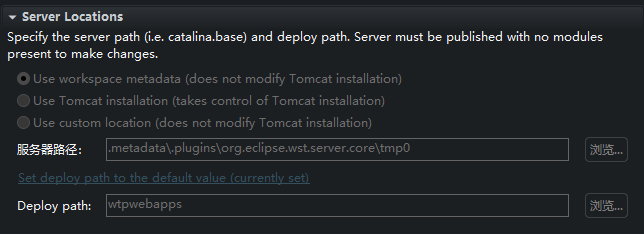

#! https://zhuanlan.zhihu.com/p/700578026

# Part 接口实现文件上传与文件下载

本文介绍使用 Servlet 3.0 中的 Part 接口实现文件上传，以及介绍图片的 base64 显示和文件下载。使用 Part 接口上传文件是一种比较简单的方式。

## 文件上传表单

```html
<form action="UploadServlet" method="post" enctype="multipart/form-data">
    <label for="file">选择图片:</label>
    <input type="file" id="file" name="file" required><br><br>
    <input type="submit" value="上传">
</form>
```

文件上传必须指定表单中 `form` 的属性 `enctype="multipart/form-data"`，由于 `GET` 有数据量限制且 `GET` 只限于传输 ASCII 的字符，而 `POST` 没有数据量限制、支持任意数据类型、安全，所有我们一般采用 `POST` 来上传文件。

`form` 的 `action` 属性在这里指定由哪个 servlet 来处理此表单。

上传单文件则指定 `input` 的 `type = "file"`，如果需要上传文件夹中的所有文件则指定 `type = "file[]"`

`input` 的 `name` 属性指定的是表单中的字段名

## Part 接口实现文件上传

```Java
@WebServlet("/UploadServlet")//URL映射
public class UploadServlet extends HttpServlet {
    protected void doPost(HttpServletRequest request) throws ServletException, IOException {
        // 检查请求是否包含多部分数据
        if (!request.getContentType().startsWith("multipart/form-data")) {
            throw new ServletException("请求不是multipart/form-data类型");
        }

        // 获取上传的文件部分
        Part filePart = request.getPart("uploadedFile");

        // 获取文件名
        String fileName = Paths.get(filePart.getSubmittedFileName()).getFileName().toString();

        // 创建upload文件夹
        File uploadDir = new File(request.getServletContext().getRealPath("upload"));//路径webapp\upload
        if (!uploadDir.exists()) 
            uploadDir.mkdir();

        // 设置保存文件的路径
        File uploadFile = new File(uploadDir.getAbsoluteFile() + "\\" + fileName);//保存至webapp\upload\fileName中

        // 用输入输出流将文件写入到上传路径中
        InputStream inputSteam = filePart.getInputStream();
        try (OutputStream outputStream = new FileOutputStream(uploadFile)) {
            byte[] buffer = new byte[4096];
            int bytesRead;
            while ((bytesRead = inputSteam.read(buffer)) != -1) {
                outputStream.write(buffer, 0, bytesRead);
            }
        }
    }
}
```

另一种方式从 `filePart` 中获取文件名：

```Java
String fileName = extractFileName(filePart); // 获取文件名

//从Part对象中提取文件名
private String extractFileName(Part part) {
    String contentDisp = part.getHeader("Content-Disposition");//Content-Disposition通常用于multipart/form-data类型的表单提交中
    String[] items = contentDisp.split(";");//将contentDisp字符串按照分号分割成数组item

    for (String item : items) 
        if (item.trim().startsWith("filename")) 
            return item.trim().split("=")[1].replace("\"", "");//获取"="后面的文件名，并去掉包围文件名的引号

    return "";
    }    
```

## base64 显示图片

有时候由于跨域问题没办法通过以下方式显示图片：

```html
" />
```

这里的 `<%= src %>` 指的是文件的绝对路径，如果是相对路径则可以正常显示。这里还需要注意，Windows 里的文件路径用反斜杆 `\` 分隔，而 类 Unix 系统一般采用 `/` 分隔路径，在网页中采用的是后者的 `/`。因此如果在 Windows 系统中要注意路径的转化：

```Java
String src = filePath.replaceAll("\\\\", "/");//regex中用\\表示一个\
```

在JSP中用 base64 显示图片：

```java
<%
    //获取图片的base64编码
    FileInputStream fis = new FileInputStream(filePath);
    byte[] bytes = fis.readAllBytes();// 读取全部图片字节数据
    String base64String = Base64.getEncoder().encodeToString(bytes);// 将字节数据编码为Base64字符串
    fis.close();
%>

">
```

## 文件下载

```Java
protected void doGet(HttpServletRequest request, HttpServletResponse response) throws ServletException, IOException {
    // 文件名和文件路径
    String fileName = request.getParameter("fileName");
    String filePath = request.getParameter("filePath");  
        
    //获取拓展名
    String extension = filePath.substring(filePath.lastIndexOf(".") + 1);

    // 设置响应的类型
    response.setContentType("image/" + extension);

    // 设置Content-Disposition响应头，提示浏览器这是一个文件下载响应
    response.setHeader("Content-Disposition", "attachment; filename=\"" + fileName + "\"");

    // 读取图片文件并发送给客户端
    try (FileInputStream fileInputStream = new FileInputStream(filePath);
        OutputStream outputStream = response.getOutputStream()) {
        byte[] buffer = new byte[4096];
        int bytesRead;
        while ((bytesRead = fileInputStream.read(buffer)) != -1) {
            outputStream.write(buffer, 0, bytesRead);
        }
    } catch (FileNotFoundException e) {
        response.sendError(HttpServletResponse.SC_NOT_FOUND, "File not found: " + filePath);
    }
}
```

## 踩坑经验

不要使用 `eclipse` 来写文件上传，建议使用 `IDEA`。下面的代码中的上传路径会在奇怪的位置：

```Java
request.getServletContext().getRealPath("upload")//webapp\upload的绝对路径
```

然而在 eclipse 中却不是在项目的 `webapp\upload` 中，原因是 `eclipse` 中指定了默认的服务器路径和 `Deploy path`，并且这些是无法修改的：



实际在 `eclipse` 中的 `upload` 文件夹在下面的路径中：

```
.metadata\.plugins\org.eclipse.wst.server.core\tmp0\wtpwebapps\UploadDemo\upload
```

这样非常不方便调试，而在IDEA中是正常的。
