#! https://zhuanlan.zhihu.com/p/701337481
# Tomcat7-maven-plugin 运行 Maven 项目

本文介绍如何在 `eclipse` 中创建 `Maven` 的 `Web` 项目，并使用 `Tomcat7-maven-plugin` 运行项目。

## Maven 配置

打开 `窗口` -> `首选项` -> `Maven`，进行以下配置：

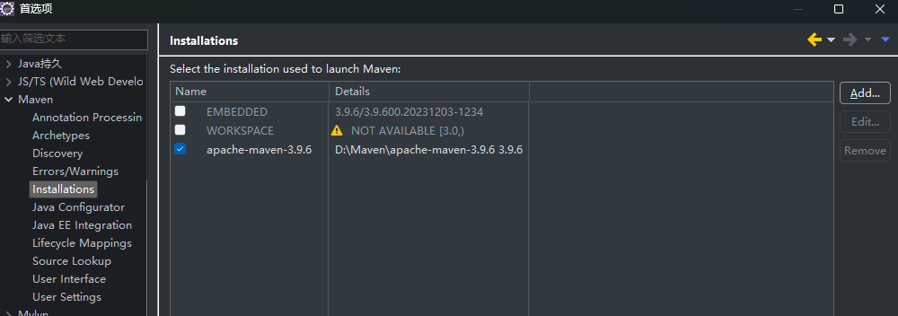

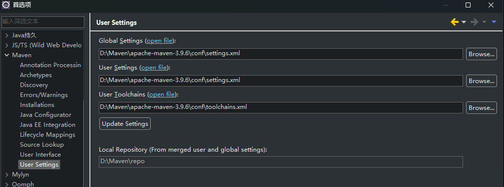

## 创建 Maven 项目

* 创建一个普通的 `Maven` 项目：

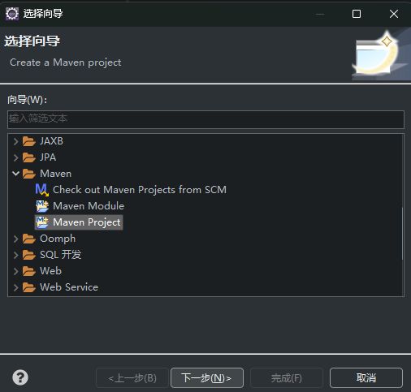

* 选择项目路径，**勾选 `create a simple project` 选项**，即不使用模板

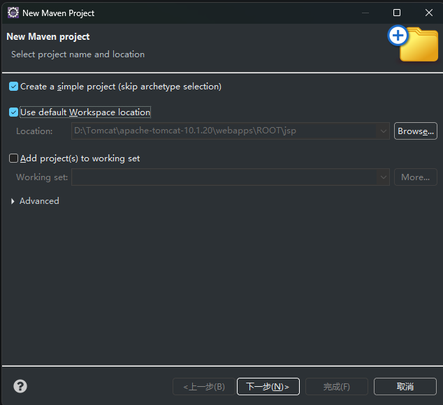

* 填写项目坐标，**Packaging 选择 `war` 表示这是一个 `web` 项目**，如果选择 `jar` 则是一个 `Java` 项目

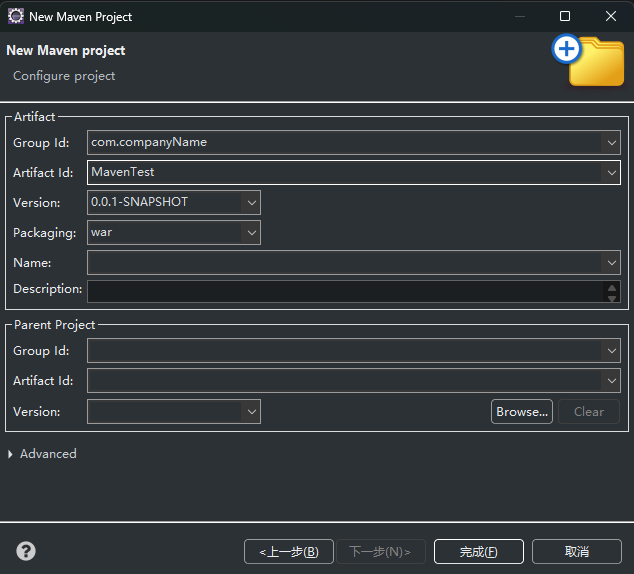

* 打开 `pom.xml`，添加项目依赖并添加 `tomcat7-maven-plugin` 插件，最终 `pom.xml` 文件如下：

```xml
<project xmlns="http://maven.apache.org/POM/4.0.0"
    xmlns:xsi="http://www.w3.org/2001/XMLSchema-instance" xsi:schemaLocation="http://maven.apache.org/POM/4.0.0 https://maven.apache.org/xsd/maven-4.0.0.xsd">
    <modelVersion>4.0.0</modelVersion>
    <groupId>com.companyName</groupId>
    <artifactId>MavenTest</artifactId>
    <version>0.0.1-SNAPSHOT</version>
    <packaging>war</packaging>

    <dependencies>
        <dependency>
            <groupId>javax.servlet</groupId>
            <artifactId>javax.servlet-api</artifactId>
            <version>3.1.0</version>
            <scope>provided</scope>
        </dependency>
        <dependency>
            <groupId>javax.servlet.jsp</groupId>
            <artifactId>javax.servlet.jsp-api</artifactId>
            <version>2.3.1</version>
            <scope>provided</scope>
        </dependency>
    </dependencies>

    <build>
        <plugins>
            <plugin>
                <groupId>org.apache.tomcat.maven</groupId>
                <artifactId>tomcat7-maven-plugin</artifactId>
                <version>2.2</version>
                <configuration>
                    <url>http://localhost:8080/manager/text</url>
                    <server>TomcatServer</server>
                    <path>/my-webapp</path>
                </configuration>
            </plugin>
        </plugins>
    </build>

</project>
```

耐心等待 `maven` 将相关资源下载到本地仓库。如果下载出错建议查看报错信息，删除下载过程中损坏的资源，然后重新创建项目。或者也可以尝试右键项目，点击 `Maven` -> `Update Project`：

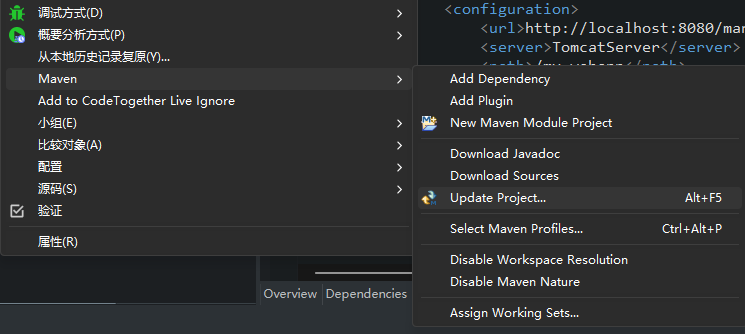

* 在 `src/main/webapp` 目录下创建 `WEB-INF` 目录，在 `WEB-INF` 中创建 `web.xml` 文件：

```xml
<?xml version="1.0" encoding="UTF-8"?>
<web-app version="2.4" 
    xmlns="http://java.sun.com/xml/ns/j2ee" 
    xmlns:xsi="http://www.w3.org/2001/XMLSchema-instance"
    xsi:schemaLocation="http://java.sun.com/xml/ns/j2ee 
        http://java.sun.com/xml/ns/j2ee/web-app_2_4.xsd">
    
</web-app>
```

在 `web-app/` 目录下创建 `index.jsp` 作为项目的主页：

```html
<%@ page contentType="text/html;charset=UTF-8" language="java" pageEncoding="UTF-8"%>
<!DOCTYPE html>
<html>
<head>
    <title>主页 - 我的Web应用</title>
</head>
<body>
    <h1>欢迎来到我的主页</h1>
    <p>这是一个简单的JSP页面示例。</p>
    
    <!-- 显示当前日期和时间 -->
    <p>当前日期和时间是: <%= new java.util.Date() %></p>
    
    <!-- 显示环境变量 -->
    <p>服务器信息: <%= application.getServerInfo() %></p>
    
    <!-- 显示会话信息 -->
    <p>会话ID: <%= session.getId() %></p>
    
    <!-- 显示请求信息 -->
    <p>请求URI: <%= request.getRequestURI() %></p>
    
    <!-- 显示服务器端口 -->
    <p>服务器端口: <%= request.getServerPort() %></p>
    
    <!-- 显示用户代理 -->
    <p>用户代理: <%= request.getHeader("User-Agent") %></p>
</body>
</html>
```

* 配置 `Maven` 的运行配置，点击 `运行` -> `运行配置` -> `Maven Build`，双击 `Maven Build` 可以新建一个配置，创建如下两个配置：

启动服务器：

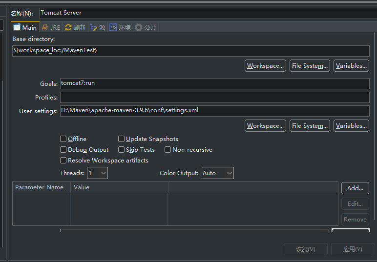

关闭服务器：

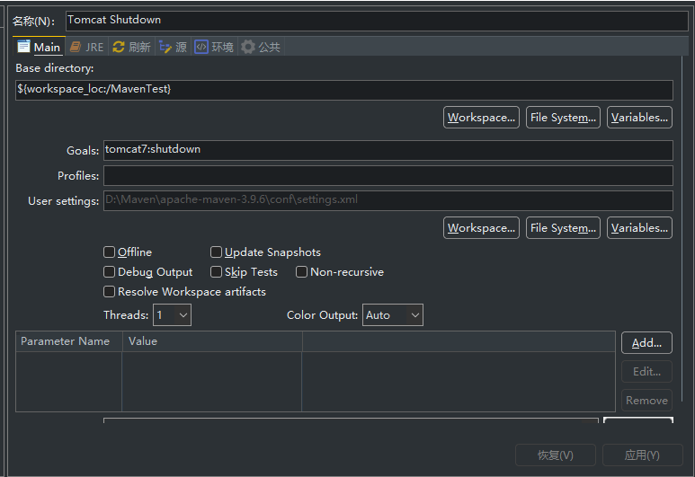

需要注意的是 `tomcat7:shutdown` 并不会关闭服务器，仍然存在进程占用 `8080` 端口。

有时候启动服务器后即使停止运行项目仍然会占用 `8080` 端口，可以在 `cmd` 中处理：

查看端口占用：

```bat
netstat -ano | findstr "8080"
```

关闭进程：

```bat
taskkill /F /PID 进程ID
```

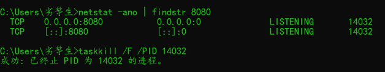

* 运行项目，右键 `MavenTest` 项目，点击 `运行方式` -> `Tomcat Server`

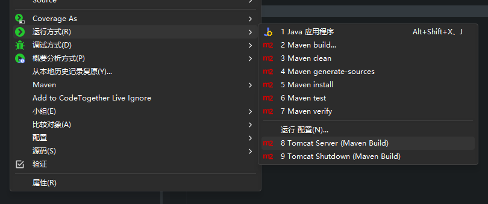

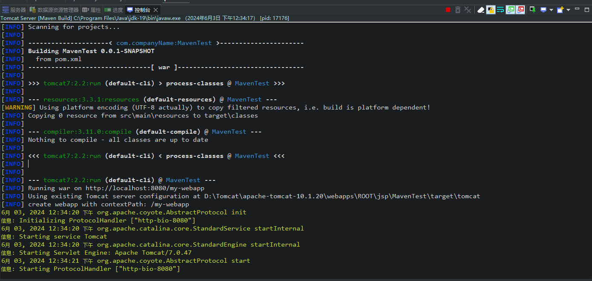

* 访问主页 `http://localhost:8080/my-webapp`

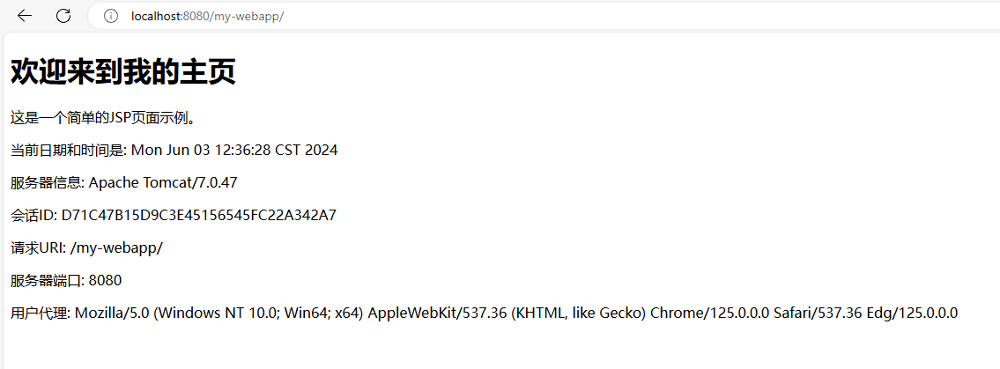

* 关闭项目，点击控制台右边的小红点可以停止服务器。

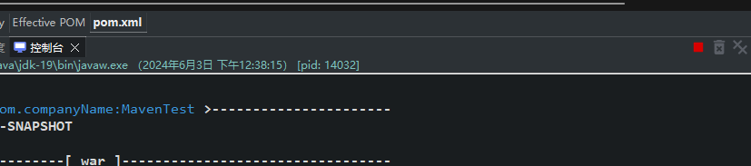