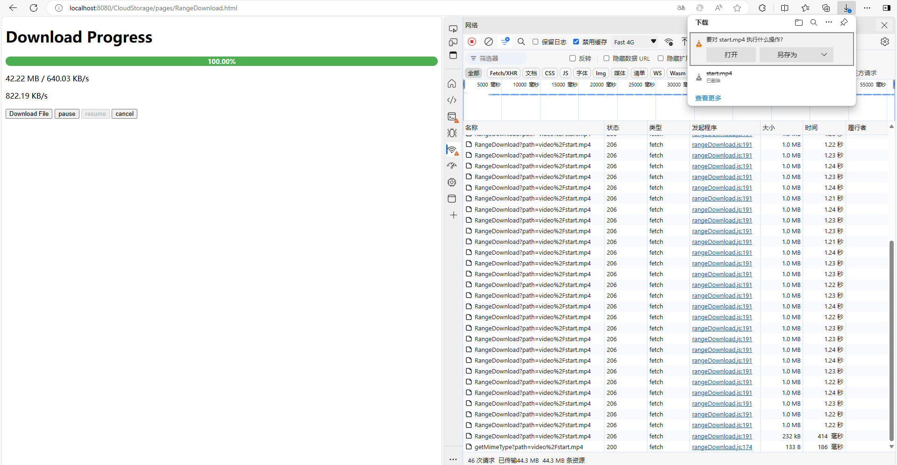
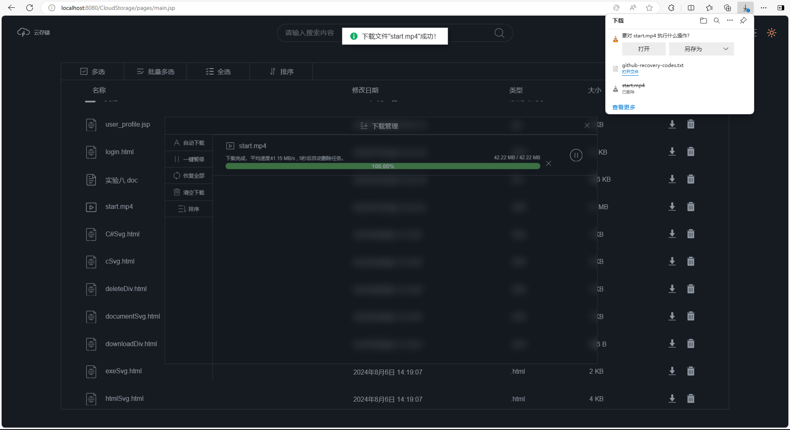

#! https://zhuanlan.zhihu.com/p/713105062
# 面向对象实现文件下载

本文介绍如何用 `javascript` 在网页中使用面向对象去解决文件下载的基本问题。使用 servlet 响应请求。

## 需求介绍

* 基本需求
    1. 根据一个文件路径，一般是在服务器中的相对路径，向服务器发起下载请求  
    2. 暂停下载
    3. 恢复下载
    4. 取消下载 
* 其他需求  
    1. 下载进度条包括百分比显示
    2. 实时下载速度显示
    3. 下载完成后计算平均下载速度

## 实现下载任务类

我们将每一个下载都与一个下载任务对象关联起来，只需管理相应的下载任务对象就能处理好所有的下载。

实现类的第一步是考虑它的数据域，包括以下内容：

1. 文件的一些基本属性：文件路径、文件大小、文件类型
2. 下载进度需要的属性：已下载的字节数
3. 实时下载速度需要的属性：上一次下载完成时的总字节数、上一次更新进度的时间、速度更新器
4. 平均下载速度需要的属性：开始下载时间、结束下载时间
5. 分片下载需要的属性：分片数组、分片大小
6. 暂停下载需要的属性：暂停的状态量、分片下载中当前下载的起始位置和终止位置
7. 请求的URL：获取文件大小URL、获取文件类型的URL、下载分片的URL

接着我们重点讲述如何实现下载功能：

下载小文件时，我们直接向服务器请求整个小文件即可。而如果文件比较大，直接请求整个文件有以下缺点：

1. 加载时间长：大文件需要更长的时间来下载，这会导致用户等待时间增加，影响用户体验。

2. 占用带宽：大文件的下载会占用大量的网络带宽，这可能会影响到同一网络下其他用户的网络体验。

3. 浏览器内存使用：如果大文件被整个加载到内存中，可能会增加浏览器的内存使用量，导致性能问题，甚至在内存不足时出现崩溃。

4. HTTP连接限制：浏览器对同一域名下的并发HTTP连接数量有限制，请求大文件时可能会达到这个限制，影响其他资源的加载。

5. 服务器压力：大量用户同时请求大文件可能会给服务器带来较大的压力，影响服务器性能和响应速度。

6. 不支持断点续传：如果下载过程中出现中断，没有断点续传支持的话，用户可能需要重新下载整个文件。

7. 不支持并行下载：单个HTTP请求无法利用多线程或多连接进行并行下载，这限制了下载速度的潜力。

web中解决大文件下载一种方式就是 **分片下载**。

### 分片下载

分片下载的原理基于HTTP协议的**范围请求**（Range Requests）特性。这是一种允许客户端请求服务器上文件的一部分，而不是整个文件的机制。在请求头中指定需要下载的字节部分然后由服务器返回对应的数据，例如设置 `Range` 为  `'bytes=0-1023'` 就可以请求从第0到1023字节的数据。

实现分片下载需要以下支持：

1. 服务器端支持：
    服务器需要支持 `HTTP Range Requests`，允许客户端请求文件的特定部分。
    设置正确的 `Content-Range` 和 `Accept-Ranges` 响应头。

2. 客户端实现：
    确定分片的数量和大小。这通常基于文件大小和网络条件来决定。
    使用支持HTTP Range Requests的HTTP客户端库来发起请求。

3. 并行请求：
    并行发起多个HTTP请求，每个请求下载文件的一个分片。
    可以使用现代浏览器的fetch API或XMLHttpRequest。

4. 数据存储：
    将下载的每个分片存储在适当的位置，通常是在内存中或临时文件中。

5. 数据合并：
    下载完成后，按照正确的顺序合并所有分片，以重建原始文件。

## 分片下载的客户端实现

以下两个函数可以在客户端实现分片下载：
`downloadChunk()` 函数根据分片范围发起分片下载请求，并将请求到的数据存入到分片数组中。
`downloadFile()` 函数主要实现分片范围的切换，以及按顺序请求分片，同时实现断点续传功能。其中的断点续传即暂停下载和恢复下载的实现，实现思路是：当暂停下载时，下载完当前分片后，将下一个下载范围记录起来，并退出当前下载；如果恢复下载后，重新调用 `downloadFile()` 即可从上一次下载的位置接着继续下载。

```javascript
async downloadChunk(start, end) {
    let fetchUrl = this.downloadChunkUrl;
    const headers = new Headers();
    headers.append('Range', `bytes = ${start} -${end} `);
    const response = await fetch(fetchUrl, { headers: headers });

    const reader = response.body.getReader();
    const readStream = async () => {
        while (true) {
            const { done, value } = await reader.read();
            if (done) break;

            this.downloaded += value.byteLength;
            this.chunks.push(value);//存入分片
        }
    };
    await readStream();
}


/* 下载文件 */
async downloadFile() {
    let start = 0;
    let end = start + this.chunkSize - 1;

    //如果存在之前的下载，从上次下载位置继续下载
    if (this.curStart != 0) {
        start = this.curStart;
        end = this.curEnd;
    }

    while (start < this.fileSize) {
        this.lastDownloaded = this.downloaded;
        await this.downloadChunk(start, end);
        start += this.chunkSize;
        end = start + this.chunkSize - 1;
        //如果暂停则下载完当前的分片，将下一个分片的范围记录下来
        if (this.isPaused) {
            this.curStart = start;
            this.curEnd = end;
            return;//退出当前下载
        }
    }
}
```

### 下载任务类的实现

以下是完整的下载任务类的实现：

```javascript
class DownloadTask {
    filePath;//文件在服务器的相对路径
    fileSize;//文件大小
    mimeType;//文件类型
    curStart;//当前下载的范围起始位置
    curEnd;//当前下载的范围的终止位置
    downloaded;//已下载的总字节数
    lastDownloaded;//上一次请求完成时下载的总字节数
    lastTime;//上次更新下载进度的时间
    startTime;//开始下载时间
    endTime;//结束下载时间
    chunks;//下载的分片
    chunkSize;//分片大小
    speed;//下载速度
    isPaused;//是否暂停的状态量
    speedUpdater;//计算速度的定时器
    static updateSpeedInterval = 250;//更新速度的间隔时间为250ms
    getFileSizeUrl = 'getFileSize';
    getMimeTypeUrl = 'getMimeType';
    downloadChunkUrl = 'RangeDownload';

    /**
     * @param {String} path 文件在服务器的相对路径
     * @param {long} chunkSize 分片大小，默认值为1MB
     */
    constructor(filePath, chunkSize = 1024 * 1024) {
        this.filePath = filePath;
        this.chunkSize = chunkSize;

        //初始化一些参数
        this.curStart = 0;
        this.curEnd = 1024 * 1024 - 1;
        this.downloaded = 0;
        this.lastDownloaded = 0;
        this.lastTime = new Date().getTime();
        this.startTime = new Date().getTime();
        this.endTime = null;
        this.chunks = [];
        this.chunkSize = chunkSize;// 1MB
        this.speed = 0;
        this.isPaused = false;

        this.getFileSizeUrl += `?path=${encodeURIComponent(this.filePath)}`;
        this.getMimeTypeUrl += `?path=${encodeURIComponent(this.filePath)}`;
        this.downloadChunkUrl += `?path=${encodeURIComponent(this.filePath)}`;
    }

    /* 获取下载速度 */
    getSpeed() {
        const currentTime = new Date().getTime();//获取当前时间的时间戳，单位ms
        const speed = (currentTime - this.lastTime) > 0 ? (this.downloaded - this.lastDownloaded) / ((currentTime - this.lastTime) / 1000) : 0;
        this.lastDownloaded = this.downloaded;
        this.lastTime = currentTime;

        if (speed > 0) {
            // 根据速度选择合适的单位显示
            let speedUnit = 'B/s';
            let displaySpeed = speed;
            if (speed >= 1024) {
                speedUnit = 'KB/s';
                displaySpeed /= 1024;
            }

            if (displaySpeed >= 1024) {
                speedUnit = 'MB/s';
                displaySpeed /= 1024;
            }

            if (displaySpeed >= 1024) {
                speedUnit = 'GB/s';
                displaySpeed /= 1024;
            }

            // 格式化速度显示为两位小数
            const formattedSpeed = displaySpeed.toFixed(2);

            const speedString = `${formattedSpeed} ${speedUnit} `;
            this.speed = speedString;

            return speedString;
        }

        return '0 B/s';
    }

    /* 获取平均下载速度 */
    getAverageSpeed() {
        this.endTime = new Date().getTime();
        const speed = (this.endTime - this.startTime) > 0 ? this.fileSize / ((this.endTime - this.startTime) / 1000) : 0;

        if (speed > 0) {
            // 根据速度选择合适的单位显示
            let speedUnit = 'B/s';
            let displaySpeed = speed;

            if (speed >= 1024) {
                speedUnit = 'KB/s';
                displaySpeed /= 1024;
            }
            if (displaySpeed >= 1024) {
                speedUnit = 'MB/s';
                displaySpeed /= 1024;
            }

            if (displaySpeed >= 1024) {
                speedUnit = 'GB/s';
                displaySpeed /= 1024;
            }

            // 格式化速度显示为两位小数
            const formattedSpeed = displaySpeed.toFixed(2);

            return `${formattedSpeed} ${speedUnit} `;
        }

        return '0 B/s';
    }

    /* 获取已下载数据大小 */
    getDownloaded() {
        const downloaded = this.downloaded;
        if (downloaded > 0) {
            // 根据数据大小选择合适的单位显示
            let dataUnit = 'B';
            let dataDownloaded = this.downloaded;

            if (dataDownloaded >= 1024) {
                dataUnit = 'KB';
                dataDownloaded /= 1024;
            }

            if (downloaded >= 1024) {
                dataUnit = 'MB';
                dataDownloaded /= 1024;
            }

            if (dataDownloaded >= 1024) {
                dataUnit = 'GB';
                dataDownloaded /= 1024;
            }

            // 格式化速度显示为两位小数
            const formattedDownloaded = dataDownloaded.toFixed(2);

            return `${formattedDownloaded} ${dataUnit} `;
        }

        return '0 B';
    }

    /* 获取文件大小 */
    async getFileSize() {
        let fetchUrl = this.getFileSizeUrl;
        try {
            const response = await fetch(fetchUrl);
            if (response.status === 400)
                throw new Error(`File path '${this.filePath}' is invalid`);
            else if (response.status === 404)
                throw new Error(`File not found or is a directory`);
            else if (response.status === 403)
                throw new Error('File cannot be read');
            else if (response.status === 500)
                throw new Error('Internal server error');
            this.fileSize = parseInt(await response.text(), 10);//文件的字节数，单位byte
        } catch (error) {
            console.error(`Fetch url: ${decodeURIComponent(fetchUrl)}`, error);
        }
    }

    /* 获取文件类型 */
    async getMimeType() {
        let fetchUrl = this.getMimeTypeUrl;
        try {
            const response = await fetch(fetchUrl);
            if (response.status === 400)
                throw new Error(`File path '${this.filePath}' is invalid`);
            else if (response.status === 500)
                throw new Error('Internal server error');
            this.mimeType = await response.text();
        } catch (error) {
            console.error(`Fetch url: ${decodeURIComponent(fetchUrl)}`, error);
        }
    }

    /* 下载分片 */
    async downloadChunk(start, end) {
        let fetchUrl = this.downloadChunkUrl;
        try {
            const headers = new Headers();
            headers.append('Range', `bytes = ${start} -${end} `);
            const response = await fetch(fetchUrl, { headers: headers });
            if (response.status === 400)
                throw new Error(`File path '${this.filePath}' is invalid`);
            else if (response.status === 404)
                throw new Error('File not found or is a directory');
            else if (response.status === 403)
                throw new Error('File cannot be read');
            else if (response.status === 500)
                throw new Error('Internal server error');

            const reader = response.body.getReader();

            const readStream = async () => {
                while (true) {
                    const { done, value } = await reader.read();
                    if (done) break;

                    this.downloaded += value.byteLength;
                    this.chunks.push(value);
                    updateProgress(this.downloaded, this.fileSize);
                }
            };

            await readStream();
        } catch (error) {
            console.error(`Fetch url: ${decodeURIComponent(fetchUrl)}`, error);
        }
    }

    /* 下载文件 */
    async downloadFile() {
        let start = 0;
        let end = start + this.chunkSize - 1;

        //如果存在之前的下载，从上次下载位置继续下载
        if (this.curStart != 0) {
            start = this.curStart;
            end = this.curEnd;
        }

        while (start < this.fileSize) {
            this.lastDownloaded = this.downloaded;
            await this.downloadChunk(start, end);
            start += this.chunkSize;
            end = start + this.chunkSize - 1;
            //如果暂停则下载完当前的分片，将下一个分片的范围记录下来
            if (this.isPaused) {
                this.curStart = start;
                this.curEnd = end;
                return;
            }
        }
    }

    /* 暂停下载 */
    pauseDownload() {
        this.isPaused = true;
    }

    /* 恢复下载 */
    resumeDownload() {
        this.isPaused = false;
    }

    /* 触发下载 */
    async triggerDownload() {
        this.getMimeType();//获取mimeType

        const blob = new Blob(this.chunks, { type: this.mimeType });//合并分片得到完整的二进制数据文件
        const url = window.URL.createObjectURL(blob);

        const a = document.createElement('a');
        a.style.display = 'none';
        a.href = url;
        a.download = this.filePath.split('/').pop();//获取文件名包括文件后缀名
        document.body.appendChild(a);
        a.click();

        //弹出下载窗口
        window.URL.revokeObjectURL(url);

        //移除下载链接
        document.body.removeChild(a);
    }
}
```

## 整体实现

### 客户端

`rangeDownload.html`

```html
<!DOCTYPE html>
<html lang="en">

<head>
    <meta charset="UTF-8">
    <title>Range Download Example</title>
    <style>
        .progressBar {
            width: 100%;
            height: 20px;
            background-color: #e0e0e0;
            border-radius: 10px;
            overflow: hidden;
            position: relative;
        }

        .progress {
            height: 100%;
            background-color: #4caf50;
            position: absolute;
            left: 0;
            top: 0;
        }

        .progress-value {
            position: absolute;
            left: 50%;
            top: 50%;
            transform: translate(-50%, -50%);
            color: #fff;
            font-size: 14px;
            font-weight: bold;
        }

        #downloadSpeed {
            margin-right: 1vw;
        }
    </style>
    <script defer src="../js/rangeDownload.js"></script>
</head>

<body>
    <h1>Download Progress</h1>
    <div class="progressBar">
        <div class="progress" value="0%"></div>
        <div class="progress-value">0%</div>
    </div>
    <p>
        <span class="downloaded"></span>
        <span class="downloadSpeed"></span>
    </p>
    <p id="averageSpeed"></p>
    <button id="downloadButton">Download File</button>
    <button id="pauseButton">pause</button>
    <button id="resumeButton">resume</button>
    <button id="cancelButton">cancel</button>
    </body>

</html>
```

`rangeDownload.js`

```javascript
class DownloadTask {
    //把类的实现复制到这里
}

/* 创建下载任务 */
var task = null;
async function createDownloadTask(filePath) {
    task = new DownloadTask(filePath);
    await task.getFileSize();
    if (task.fileSize < 1024 * 1024 * 10) { // 小于 10MB 直接下载
        task.downloadChunk(0, task.fileSize - 1).then(() => {
            updateProgress(task.fileSize, task.fileSize);
        });
    } else {
        //间隔0.5s计算一次实时下载速度
        task.speedUpdater = setInterval(() => {
            task.getSpeed();
            document.querySelector('.downloadSpeed').textContent = task.speed;
        }, DownloadTask.updateSpeedInterval);
        task.downloadFile();
    }
}

/* 更新下载进度 */
function updateProgress(loaded, total) {
    const progress = (loaded / total) * 100;
    downloaded = loaded;
    document.querySelector('.progress').style.width = `${progress.toFixed(2)}%`;
    document.querySelector('.progress').setAttribute('value', `${progress.toFixed(2)}%`);
    document.querySelector('.progress-value').textContent = `${progress.toFixed(2)}%`;
    document.querySelector('.downloaded').textContent = `${task.getDownloaded()}/`;
}

/* 重置下载进度 */
function resetProgress() {
    document.querySelector('.progress').style.width = '0%';
    document.querySelector('.progress').setAttribute('value', '0%');
    document.querySelector('.progress-value').textContent = '0%';
}

document.addEventListener('DOMContentLoaded', function () {
    const progressElement = document.querySelector('.progress');

    const observer = new MutationObserver((mutations) => {
        mutations.forEach((mutation) => {
            if (mutation.attributeName === 'value') {
                const currentValue = mutation.target.getAttribute('value');
                if (currentValue === '100.00%') {
                    observer.disconnect(); // 断开观察
                    clearInterval(task.speedUpdater); // 清除速度的更新器
                    task.triggerDownload(); // 触发文件下载
                    document.getElementById('averageSpeed').textContent = task.getAverageSpeed(); // 计算平均下载速度
                }
            }
        });
    });

    // 配置MutationObserver选项
    const config = { attributes: true, attributeFilter: ['value'] };
    observer.observe(progressElement, config);
});

let downloadButton = document.getElementById('downloadButton');
let pauseButton = document.getElementById('pauseButton');
let resumeButton = document.getElementById('resumeButton');
let cancelButton = document.getElementById('cancelButton');

pauseButton.disabled = true;
resumeButton.disabled = true;
cancelButton.disabled = true;

//下载
downloadButton.addEventListener('click', () => {
    pauseButton.disabled = false;
    cancelButton.disabled = false;
    createDownloadTask('video/start.mp4');
});

// 暂停下载
pauseButton.addEventListener('click', () => {
    task.pauseDownload();
    console.log(`${task.curStart}, ${task.curEnd} `);
    pauseButton.disabled = true;
    resumeButton.disabled = false;
});

// 恢复下载
resumeButton.addEventListener('click', () => {
    task.resumeDownload();
    pauseButton.disabled = false;
    resumeButton.disabled = true;
    task.downloadFile();//继续下载
});

//取消下载
cancelButton.addEventListener('click', () => {
    task.pauseDownload();
    pauseButton.disabled = true;
    resumeButton.disabled = true;
    setTimeout(() => {
        resetProgress();
        clearInterval(task.speedUpdater); // 清除速度的更新器
        task = null;
    }, 1000);
});
```

### 服务端

`GetFileSize.java`

```java
package servlet;
import javax.servlet.ServletException;
import javax.servlet.annotation.WebServlet;
import javax.servlet.http.HttpServlet;
import javax.servlet.http.HttpServletRequest;
import javax.servlet.http.HttpServletResponse;
import java.io.File;
import java.io.IOException;

@WebServlet("/pages/getFileSize")
public class GetFileSize extends HttpServlet {
    protected void doGet(HttpServletRequest request, HttpServletResponse response) throws ServletException, IOException {
        try {
            String path = request.getParameter("path");

            if (path == null || path.trim().isEmpty()) {
                response.sendError(HttpServletResponse.SC_BAD_REQUEST, "Invalid path parameter");
                return;
            }
            String filePath = getServletContext().getRealPath(path); // 获取文件的绝对路径

            System.out.println("File path: " + filePath);

            File file = new File(filePath);

            if (!file.exists() || file.isDirectory()) {
                response.sendError(HttpServletResponse.SC_NOT_FOUND, "File not found or is a directory");
                return;
            }

            if (!file.canRead()) {
                response.sendError(HttpServletResponse.SC_FORBIDDEN, "File cannot be read");
                return;
            }

            long fileSize = file.length(); // 获取文件大小
            response.setContentType("text/plain");
            response.getWriter().write(String.valueOf(fileSize)); // 将文件大小写入响应体
            response.getWriter().flush();
            response.getWriter().close();
        } catch (Exception e) {
            e.printStackTrace();
            response.sendError(HttpServletResponse.SC_INTERNAL_SERVER_ERROR, "Internal server error"); // 服务器内部错误时返回500错误
        }
    }
}
```

`RangeDownload.java`

```java
package servlet;

import javax.servlet.*;
import javax.servlet.annotation.WebServlet;
import javax.servlet.http.*;
import java.io.*;

@WebServlet(name = "RangeDownload", urlPatterns = {"/pages/RangeDownload"})
public class RangeDownload extends HttpServlet {
    private static final long serialVersionUID = 1L;

    protected void doGet(HttpServletRequest request, HttpServletResponse response) throws ServletException, IOException {
        try {
            String path = request.getParameter("path");
            if (path == null || path.trim().isEmpty()) {
                response.sendError(HttpServletResponse.SC_BAD_REQUEST, "Invalid path parameter");
                return;
            }

            String filePath = getServletContext().getRealPath(path);
            File file = new File(filePath);

            if (!file.exists() || file.isDirectory()) {
                response.sendError(HttpServletResponse.SC_NOT_FOUND, "File not found or is a directory");
                return;
            }

            if (!file.canRead()) {
                response.sendError(HttpServletResponse.SC_FORBIDDEN, "File cannot be read");
                return;
            }

            long fileSize = file.length();

            response.setContentType("application/octet-stream");
            response.setHeader("Content-Disposition", "attachment;filename=\"" + file.getName() + "\"");

            // 检查请求中是否包含Range头
            String range = request.getHeader("Range");
            if (range != null && range.startsWith("bytes=")) {
                range = range.substring(6);
                int index = range.indexOf('-');
                if (index > 0) {
                    long start = Long.parseLong(range.substring(0, index));
                    long end = Long.parseLong(range.substring(index + 1, range.length()));

                    if (end >= fileSize) {
                        end = fileSize - 1;
                    }

                    response.setStatus(HttpServletResponse.SC_PARTIAL_CONTENT);
                    response.setHeader("Content-Range", "bytes " + start + "-" + end + "/" + fileSize);
                    response.setContentLength((int) (end - start + 1));

                    // 设置输入流读取文件的指定部分
                    FileInputStream fis = new FileInputStream(file);
                    fis.skip(start);

                    OutputStream os = response.getOutputStream();
                    byte[] buffer = new byte[4096];
                    int bytesRead;
                    while ((bytesRead = fis.read(buffer)) != -1) {
                        os.write(buffer, 0, bytesRead);
                    }

                    fis.close();
                    os.close();
                }
            } else {
                // 没有Range头，发送整个文件
                response.setHeader("Content-Length", String.valueOf(fileSize));
                FileInputStream fis = new FileInputStream(file);
                OutputStream os = response.getOutputStream();
                byte[] buffer = new byte[4096];
                int bytesRead;
                while ((bytesRead = fis.read(buffer)) != -1) {
                    os.write(buffer, 0, bytesRead);
                }
                fis.close();
                os.close();
            }
        } catch (Exception e) {
            e.printStackTrace();
            response.sendError(HttpServletResponse.SC_INTERNAL_SERVER_ERROR, "Internal server error"); // 服务器内部错误时返回500错误
        }
    }
}
```

`GetMimeType.java`

此 `servlet` 返回文件类型，用于在触发下载时指定二进制数据的类型。

```java
package servlet;

import javax.servlet.annotation.WebServlet;
import javax.servlet.http.HttpServlet;
import javax.servlet.http.HttpServletRequest;
import javax.servlet.http.HttpServletResponse;
import java.io.IOException;
import java.util.HashMap;
import java.util.Map;

@WebServlet("/pages/getMimeType")
public class GetMimeType extends HttpServlet {

    public void doGet(HttpServletRequest request, HttpServletResponse response) throws IOException {
        try {
            String path = request.getParameter("path");
            if (path == null || path.trim().isEmpty()) {
                response.sendError(HttpServletResponse.SC_BAD_REQUEST, "Invalid path parameter");
                return;
            }

            String filePath = getServletContext().getRealPath(path);
            String fileName = filePath.substring(filePath.lastIndexOf('/') + 1);
            String extension = getFileExtension(fileName);

            String mimeType = getMimeType(extension);
            response.getWriter().println(mimeType);
        } catch(Exception ex){
            ex.printStackTrace();
            response.sendError(HttpServletResponse.SC_INTERNAL_SERVER_ERROR, "Internal server error"); // 服务器内部错误时返回500错误
        }
    }

    public void doPost(HttpServletRequest request, HttpServletResponse response) throws IOException {
        doGet(request, response);
    }

    // 工具方法：获取文件扩展名
    private String getFileExtension(String fileName) {
        int lastIndexOf = fileName.lastIndexOf('.');
        return (lastIndexOf == -1) ? "" : fileName.substring(lastIndexOf + 1);
    }

    private String getMimeType(String extension) {
        // 定义一个Map来存储文件扩展名和对应的MIME类型
        Map<String, String> mimeTypes = new HashMap<>();
        //application
        mimeTypes.put("pdf", "application/pdf");
        mimeTypes.put("doc", "application/msword");
        mimeTypes.put("docx", "application/vnd.openxmlformats-officedocument.wordprocessingml.document");
        mimeTypes.put("xls", "application/vnd.ms-excel");
        mimeTypes.put("xlsx", "application/vnd.openxmlformats-officedocument.spreadsheetml.sheet");
        mimeTypes.put("ppt", "application/vnd.ms-powerpoint");
        mimeTypes.put("pptx", "application/vnd.openxmlformats-officedocument.presentationml.presentation");
        mimeTypes.put("zip", "application/zip");
        mimeTypes.put("gz", "application/gzip");
        mimeTypes.put("tar", "application/x-tar");
        mimeTypes.put("swf", "application/x-shockwave-flash");
        mimeTypes.put("json", "application/json");

        //image, .bmp .jpg .jpeg .png .gif .svg, .ico .webp
        mimeTypes.put("bmp", "image/bmp");
        mimeTypes.put("jpg", "image/jpeg");
        mimeTypes.put("jpeg", "image/jpeg");
        mimeTypes.put("png", "image/png");
        mimeTypes.put("gif", "image/gif");
        mimeTypes.put("svg", "image/svg+xml");
        mimeTypes.put("ico", "image/x-icon");
        mimeTypes.put("webp", "image/webp");
        mimeTypes.put("tiff", "image/tiff");
        mimeTypes.put("tif", "image/tiff");
        mimeTypes.put("psd", "image/vnd.adobe.photoshop");
        mimeTypes.put("raw", "image/x-raw");
        mimeTypes.put("cr2", "image/x-canon-cr2");
        mimeTypes.put("nef", "image/x-nikon-nef");
        mimeTypes.put("orf", "image/x-olympus-orf");
        mimeTypes.put("raf", "image/x-fuji-raf");
        mimeTypes.put("arw", "image/x-sony-arw");
        mimeTypes.put("dng", "image/x-adobe-dng");
        mimeTypes.put("heic", "image/heic");
        mimeTypes.put("heif", "image/heif");

        //audio, .mp3 .wav .ogg .flac .aac .m4a .wma .amr .alac .mid .midi .aiff .aif .mp2 .mka .voc
        mimeTypes.put("mp3", "audio/mpeg"); // 标准MPEG音频层III
        mimeTypes.put("wav", "audio/wav"); // wav
        mimeTypes.put("ogg", "audio/ogg"); // Ogg Vorbis音频
        mimeTypes.put("flac", "audio/flac"); // 无损音频格式
        mimeTypes.put("aac", "audio/aac"); // 高效高级音频编码
        mimeTypes.put("opus", "audio/opus"); // Opus音频编码
        mimeTypes.put("m4a", "audio/m4a"); // MPEG-4音频
        mimeTypes.put("wma", "audio/x-ms-wma"); // Windows Media音频
        mimeTypes.put("amr", "audio/amr"); // 适应性多速率音频
        mimeTypes.put("alac", "audio/x-alac"); // Apple无损音频编码
        mimeTypes.put("mid", "audio/midi"); // MIDI音频
        mimeTypes.put("midi", "audio/midi"); // MIDI音频
        mimeTypes.put("aiff", "audio/aiff"); // 音频交换文件格式
        mimeTypes.put("aif", "audio/aiff"); // 音频交换文件格式
        mimeTypes.put("mp2", "audio/mpeg"); // MPEG音频层II
        mimeTypes.put("mka", "audio/x-matroska"); // Matroska音频
        mimeTypes.put("voc", "audio/x-voc"); // Creative Voice文件

        //video, .mp4 .avi .wmv .flv .mov .mkv .webm .3gp .3gpp .m3u8 .ts .m4v .f4v .vob .asf .m2ts .rm .ogv .gifv .m3u8
        mimeTypes.put("mp4", "video/mp4"); // 通常用于HTML5视频
        mimeTypes.put("avi", "video/x-msvideo"); // 微软的视频格式
        mimeTypes.put("wmv", "video/x-ms-wmv"); // Windows Media Video
        mimeTypes.put("flv", "video/x-flv"); // Flash视频格式
        mimeTypes.put("mov", "video/quicktime"); // QuickTime视频
        mimeTypes.put("mkv", "video/x-matroska"); // Matroska视频
        mimeTypes.put("webm", "video/webm"); // WebM视频格式
        mimeTypes.put("3gp", "video/3gpp"); // 3G移动电话视频
        mimeTypes.put("3gpp", "video/3gpp"); // 3GPP视频
        mimeTypes.put("m3u8", "application/x-mpegURL"); // HLS (HTTP Live Streaming) 播放列表
        mimeTypes.put("ts", "video/MP2T"); // MPEG传输流
        mimeTypes.put("m4v", "video/x-m4v"); // MPEG-4视频
        mimeTypes.put("f4v", "video/mp4"); // Adobe Flash视频
        mimeTypes.put("vob", "video/x-ms-vob"); // DVD视频对象
        mimeTypes.put("asf", "video/x-ms-asf"); // 微软高级流格式
        mimeTypes.put("m2ts", "video/MP2T"); // 蓝光光盘视频
        mimeTypes.put("rm", "application/vnd.rn-realmedia"); // RealMedia视频
        mimeTypes.put("ogv", "video/ogg"); // Ogg视频
        mimeTypes.put("gifv", "video/gif"); // 视频GIF
        mimeTypes.put("m3u8", "application/x-mpegURL"); // HLS (HTTP Live Streaming) 播放列表

        //text, .txt .html .htm .css .js .xml .csv .java .c .cpp .cs .py .rb .php .pl .sh .sql .bat .ps1 .go .swift .kt .scala .groovy .h .hpp .yml .yaml .rs
        mimeTypes.put("md", "text/markdown"); // Markdown文件
        mimeTypes.put("txt", "text/plain");
        mimeTypes.put("html", "text/html");
        mimeTypes.put("htm", "text/html");
        mimeTypes.put("css", "text/css");
        mimeTypes.put("js", "text/javascript");
        mimeTypes.put("xml", "text/xml");
        mimeTypes.put("csv", "text/csv");
        mimeTypes.put("java", "text/x-java-source,java"); // Java源文件
        mimeTypes.put("c", "text/x-csrc"); // C语言源文件
        mimeTypes.put("cpp", "text/x-c++src"); // C++源文件
        mimeTypes.put("cs", "text/x-csharp"); // C#源文件
        mimeTypes.put("py", "text/x-python"); // Python源文件
        mimeTypes.put("rb", "text/x-ruby"); // Ruby源文件
        mimeTypes.put("php", "application/x-httpd-php"); // PHP源文件
        mimeTypes.put("pl", "text/x-perl"); // Perl脚本
        mimeTypes.put("sh", "text/x-shellscript"); // Shell脚本
        mimeTypes.put("sql", "text/x-sql"); // SQL脚本
        mimeTypes.put("bat", "text/x-msdos-batch"); // Windows批处理文件
        mimeTypes.put("ps1", "application/x-powershell"); // PowerShell脚本
        mimeTypes.put("go", "text/x-go"); // Go语言源文件
        mimeTypes.put("swift", "text/x-swift"); // Swift源文件
        mimeTypes.put("kt", "text/x-kotlin"); // Kotlin源文件
        mimeTypes.put("scala", "text/x-scala"); // Scala源文件
        mimeTypes.put("groovy", "text/x-groovy"); // Groovy源文件
        mimeTypes.put("h", "text/x-chdr"); // C/C++头文件
        mimeTypes.put("hpp", "text/x-c++hdr"); // C++头文件
        mimeTypes.put("yml", "text/x-yaml"); // YAML配置文件
        mimeTypes.put("yaml", "text/x-yaml"); // YAML配置文件
        mimeTypes.put("rs", "text/x-rustsrc"); // Rust源文件

        // 检查扩展名是否存在于Map中，如果存在则返回对应的MIME类型
        return mimeTypes.getOrDefault(extension.toLowerCase(), "application/octet-stream");
    }
}
```

运行效果：



## 推荐

如果你有兴趣可以在 [https://github.com/Eternal-embers/cloud_storage](https://github.com/Eternal-embers/cloud_storage) 中获取到更加完整的实现，实现效果：

