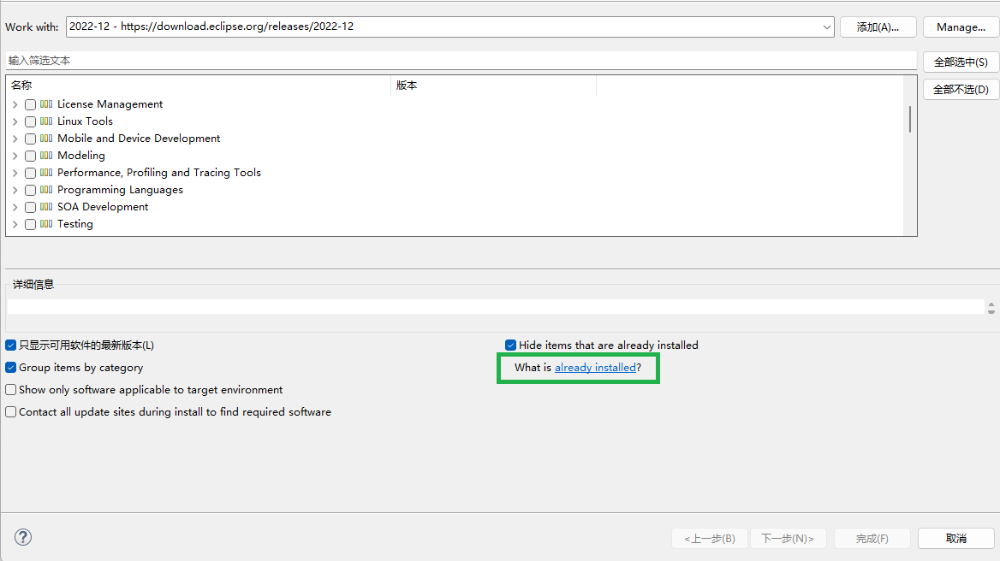

#! https://zhuanlan.zhihu.com/p/694287150

# eclipse配置tomcat和创建jsp项目

> 本教程适用于安装的是 `eclipse JavaEE` 版本的对象，如果你安装的是 `eclipse Java web` 版本，那么教程中的下载组件部分可以跳过。一般学习 `Java` 时安装的都是 `eclipse JavaEE` 版本。

## 如何打开环境变量

点击 `设置` $\rightarrow$ `系统信息` $\rightarrow$ `高级系统设置` $\rightarrow$ `环境变量`

或者 `win + r` 然后输入 `sysdm.cpl`，点击 `高级` $\rightarrow$ `环境变量`

> 环境变量可以配置到用户变量或系统变量中，系统变量对所有用户都有效，用户变量只对当前用户有效。

填路径时需要用 `;` 将不同的路径分隔。如果是以下情况则不需要：


## 下载JDK

如果你之前使用 `eclipse` 学习过 `Java`，那么相信你已经完成了这一步，可以跳过此节。

[oracle官网下载页面](https://www.oracle.com/downloads/)

[各版本的jdk官网下载](https://www.oracle.com/java/technologies/downloads/)

[JDK 22 windows_x64 下载](https://download.oracle.com/java/22/latest/jdk-22_windows-x64_bin.zip)

[JDK 8 windows_x64 下载](https://download.oracle.com/otn/java/jdk/8u411-b09/43d62d619be4e416215729597d70b8ac/jdk-8u411-windows-i586.exe)

下载好jdk后将其解压到你想要放的位置，然后配置环境变量。

添加用户变量：

添加`JAVA_HOME` 变量，路径填jdk的文件夹位置。

`C:\Program Files\Java\jdk-19`

添加 `CLASSPATH` 变量，路径填入以下内容

`.;%JAVA_HOME%\lib;%JAVA_HOME%\lib\tools.jar;`

在用户变量的 `path` 变量中添加以下内容：

`%JAVA_HOME%\bin`

`win + r` 输入 `cmd`，再输入 `java`，如果无报错提示则说明配置成功。

在 `eclipse` 中配置安装的 `JDK`，注意每个项目可以配置不同的 `JDK`，手动配置的 `JDK` 只会对当前项目生效，如果你的某个项目需要使用特定版本的 `JDK` 或者更新版本的 `JDK`，或者项目缺少 `JRE` 系统库，那么你需要进行下面的配置：

点击 `项目` -> `属性` -> `Java 构建路径` -> `模块路径` -> `添加库` -> `JRE 系统库` -> `备用JRE` -> `已安装JRE`

`JRE` 路径选择安装的 `JDK` 的根目录即可，例如 `C:\Program Files\Java\jdk-19`


最终配置好的系统库如下：

![模块路径-JRE系统库[JAVAEE-19]](./img/jdk.png)

## 下载tomcat

[tomcat官网](https://tomcat.apache.org/)

这里建议下载tomcat 10，elipse暂时没有tomcat 11的选项。下载速度较慢，耐心等待。

[tomcat 10 windows-x64](https://dlcdn.apache.org/tomcat/tomcat-10/v10.1.23/bin/apache-tomcat-10.1.23-windows-x64.zip)

下载完成后，将其解压到D盘tomcat的文件夹中，方便查找：


添加一个用户变量，路径位置是`tomcat`的`bin`目录的上一级文件夹。

`CATALINA_HOME` `D:\Tomcat\apache-tomcat-10.1.20-windows-x64\apache-tomcat-10.1.20`

在用户变量的path变量中添加以下路径：

`%CATALINA_HOME%\bin`

检查`tomcat`环境变量是否配置成功，`win + r` 输入 `cmd`，再输入 `startup` 并回车。


此时如果正常将完成启动服务器。然后在浏览器中输入 `http://localhost:8080`

此时在浏览器将可以正常访问 `http://localhost:8080`


## 配置tomcat

在路径 `D:\Tomcat\apache-tomcat-10.1.20-windows-x64\apache-tomcat-10.1.20\webapps\ROOT` 中创建一个 jsp 文件夹，用 eclipse 打开此文件夹。

> 每次配置只会对 `eclipse` 当前打开的项目生效，下次打开此项目无需再次配置。
> 路径不可照搬，请参考你的 `tomcat` 位置。

点击 `文件(file)` $\rightarrow$ `新建(new)` $\rightarrow$ `项目` $\rightarrow$ `web`

如果没有找到 `web` 选项，进行以下操作：

点击 `帮助(help)` $\rightarrow$ `安装新软件(install new software)`

选择站点：


勾选 `Web,XML,Java EE and OSGI Enterprise Development` 选项将下载所有 `web` 组件。如果你不想一次性下载这么多，只需要勾选 `Web` 组件中的这些选项：

eclipse 2024-03版本

```text
Eclipse Java EE Developer Tools
Eclipse Java Web Developer Tools
Eclipse Java Web Developer Tools - JavaScript Support
Eclipse Web Developer Tools
Eclipse Web JavaScript Developer Tools
JST Server Adapters
JST Server Adapters Extensions
JST Server UI
```

旧eclipse版本：

```text
Eclipse Java EE Developer Tools
Eclipse Java Web Developer Tools
Eclipse Web Developer Tools
Eclipse XML Editors and Tools
JST Server Adapters
JST Server Adapters Extensions
JST Server UI
```

有些选项在不同版本的eclipse里可能没有，下载组件时间较长，请耐心等待。

点击 `already installed` 可以查看已经安装的组件：



> 在较新版本的eclipse中如果没有安装上面提到的 web 组件可能创建项目时没有 `Dynamic Web Project`，在窗口(window)的首选项(preference) 里可能没有 `server` 选项。如果你的老版本的 eclipse 有这些选项那么不需要安装上面的web组件。

下载并安装完组件后，执行以下操作配置 `tomcat`：

点击 `窗口(window)` $\rightarrow$ `首选项(preferences)` $\rightarrow$ `server` $\rightarrow$ `runtime Environments` $\rightarrow$ `add`

根据你下载的 `tomcat` 版本添加：


打开 `server` 窗口，点击 `窗口` $\rightarrow$ `显示视图` $\rightarrow$ `其他` $\rightarrow$ `server`


创建 `server`，点击 `No servers are avaliable....` 那里：


配置 tomcat server，`deploy path` 填文件夹 `webapps` 的路径：

`D:\Tomcat\apache-tomcat-10.1.20-windows-x64\apache-tomcat-10.1.20\webapps`


启动 `tomcat server`，右键并点击 `start`：


## 添加依赖

运行 `.jsp` 文件需要 `servlet-api`，而 `servlet-api.jar` 在我们下载的 `tomcat` 中存在。可以采取以下两种方式：

1. 下载 `servlet-api.jar` 并将其移动到项目的 `src/main/webapp/WEB-INF/lib` 下:

    [servlet-api-2.5](https://repo1.maven.org/maven2/javax/servlet/servlet-api/2.5/servlet-api-2.5.jar)

    [servlet-api历史版本下载](https://mvnrepository.com/artifact/javax.servlet/servlet-api)

2. 也可以通过添加构建路径实现，右键项目，点击 `构建路径` -> `配置构建路径`


点击 `类路径` -> `添加库` -> `服务器运行时(server runtime)`


添加 `服务器路径容器`


## 创建jsp项目

点击 `文件(file)` $\rightarrow$ `新建(new)` $\rightarrow$ `项目(project)` $\rightarrow$ `Dynamic Web Project`


接着输入项目名称然后一直点击下一步，最后一步记得勾选 `generate web.xml deployment descriptor` 然后点击完成(Finish)。

右键 `webapp`，点击 `新建(new)` $\rightarrow$ `jsp 文件(jsp file)`，输入文件名点击完成(Finish)即可。

编写以下代码：

```html
<%@ page language="java" contentType="text/html; charset=ISO-8859-1"
    pageEncoding="ISO-8859-1"%>
<!DOCTYPE html>

<html>

<head>
    <meta charset="UTF-8">
    <meta name="viewport" content="width=device-width,initial-scale=1">
    <title>my first web file</title>
    <style>
    * {
        margin: 0;
        padding: 0;
        box-sizing: border-box;
    }
    
    section {
        display: flex;
        justify-content: center;
        align-items: center;
        min-height: 100vh;
        background: #042104;
        filter: hue-rotate(70deg);
    }
    
    .loader {
        position: relative;
        transform: rotate(calc(45deg * var(--r)));
    }
    
    .loader span {
        position: absolute;
        top: 0;
        left: -200px;
        width: 200px;
        height: 2px;
        transform-origin: right;
        transform: rotate(calc(18deg * var(--i)));
    }
    
    .loader span::before {
        content: '';
        position: absolute;
        top: calc(-15px / 2);
        width: 15px;
        height: 15px;
        background: #ffffff;
        border-radius: 50%;
        box-shadow:
            0 0 10px #ffffff,
            0 0 20px #ffffff,
            0 0 40px #ffffff,
            0 0 60px #ffffff,
            0 0 80px #ffffff,
            0 0 100px #ffffff;
        animation: animate 5s linear infinite;
        animation-delay: calc(-0.5s * var(--i));
    }
    
    @keyframes animate {
        0% {
            transform: translateX(200px) scale(1);
            opcity: 0;
        }
    
        30% {
            opcity: 1;
        }
    
        60% {
            opcity: 1;
        }
    
        100% {
            transform: translateX(10px) scale(0);
            opcity: 0;
        }
    }
    </style>
</head>

<body>
    <section>
        <div class="loader" style="--r:1;">
            <span style="--i:1;"></span>
            <span style="--i:2;"></span>
            <span style="--i:3;"></span>
            <span style="--i:4;"></span>
            <span style="--i:5;"></span>
            <span style="--i:6;"></span>
            <span style="--i:7;"></span>
            <span style="--i:8;"></span>
            <span style="--i:9;"></span>
            <span style="--i:10;"></span>
            <span style="--i:11;"></span>
            <span style="--i:12;"></span>
            <span style="--i:13;"></span>
            <span style="--i:14;"></span>
            <span style="--i:15;"></span>
            <span style="--i:16;"></span>
            <span style="--i:17;"></span>
            <span style="--i:18;"></span>
            <span style="--i:19;"></span>
            <span style="--i:20;"></span>
        </div>
        <div class="loader" style="--r:2;">
            <span style="--i:1;"></span>
            <span style="--i:2;"></span>
            <span style="--i:3;"></span>
            <span style="--i:4;"></span>
            <span style="--i:5;"></span>
            <span style="--i:6;"></span>
            <span style="--i:7;"></span>
            <span style="--i:8;"></span>
            <span style="--i:9;"></span>
            <span style="--i:10;"></span>
            <span style="--i:11;"></span>
            <span style="--i:12;"></span>
            <span style="--i:13;"></span>
            <span style="--i:14;"></span>
            <span style="--i:15;"></span>
            <span style="--i:16;"></span>
            <span style="--i:17;"></span>
            <span style="--i:18;"></span>
            <span style="--i:19;"></span>
            <span style="--i:20;"></span>
        </div>
        <div class="loader" style="--r:3;">
            <span style="--i:1;"></span>
            <span style="--i:2;"></span>
            <span style="--i:3;"></span>
            <span style="--i:4;"></span>
            <span style="--i:5;"></span>
            <span style="--i:6;"></span>
            <span style="--i:7;"></span>
            <span style="--i:8;"></span>
            <span style="--i:9;"></span>
            <span style="--i:10;"></span>
            <span style="--i:11;"></span>
            <span style="--i:12;"></span>
            <span style="--i:13;"></span>
            <span style="--i:14;"></span>
            <span style="--i:15;"></span>
            <span style="--i:16;"></span>
            <span style="--i:17;"></span>
            <span style="--i:18;"></span>
            <span style="--i:19;"></span>
            <span style="--i:20;"></span>
        </div>
        <div class="loader" style="--r:4;">
            <span style="--i:1;"></span>
            <span style="--i:2;"></span>
            <span style="--i:3;"></span>
            <span style="--i:4;"></span>
            <span style="--i:5;"></span>
            <span style="--i:6;"></span>
            <span style="--i:7;"></span>
            <span style="--i:8;"></span>
            <span style="--i:9;"></span>
            <span style="--i:10;"></span>
            <span style="--i:11;"></span>
            <span style="--i:12;"></span>
            <span style="--i:13;"></span>
            <span style="--i:14;"></span>
            <span style="--i:15;"></span>
            <span style="--i:16;"></span>
            <span style="--i:17;"></span>
            <span style="--i:18;"></span>
            <span style="--i:19;"></span>
            <span style="--i:20;"></span>
        </div>
    </section>
</body>

</html>
```

打开 `server` 窗口(前面有操作步骤)，如果 `sever` 启动了则右键并点击 `stop`。

点击工具栏中的 `运行`，选择我们配置的服务器然后点击完成就会在浏览器中看到非常nice的画面：


相信你已经迫不及待学习更多web知识了吧。