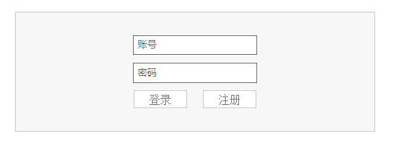
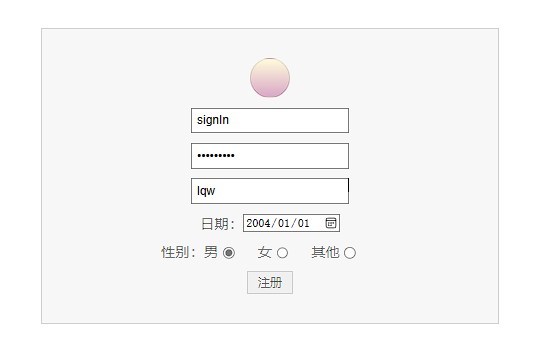
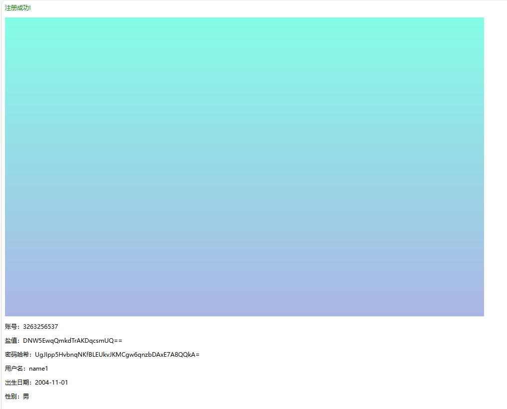
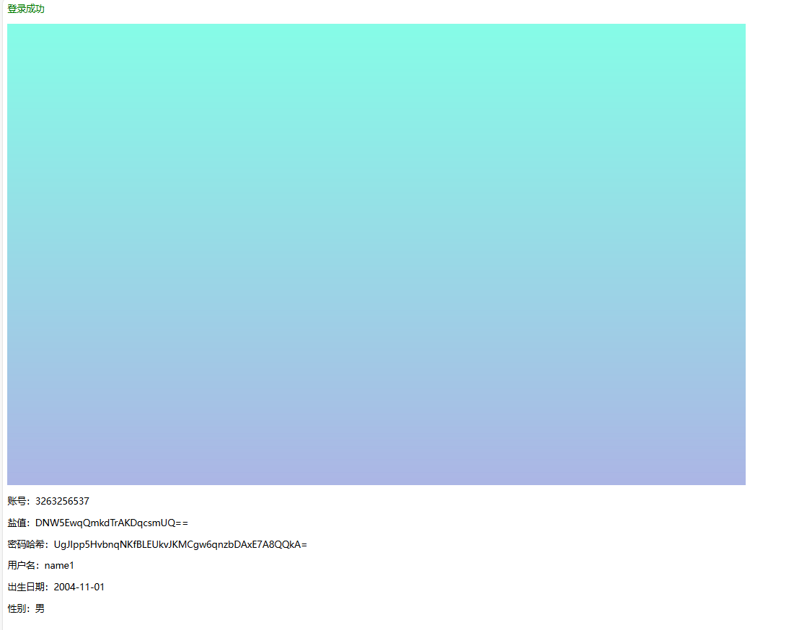
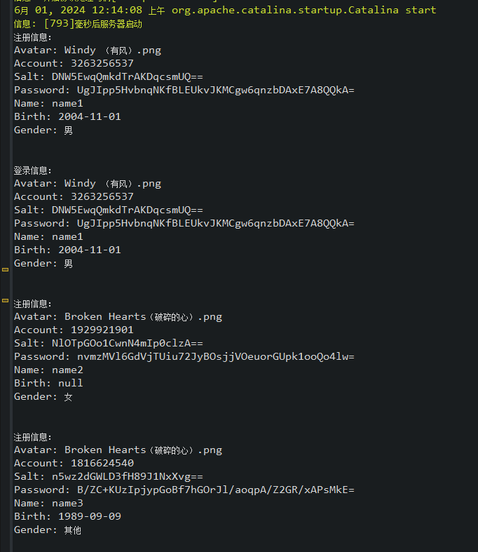
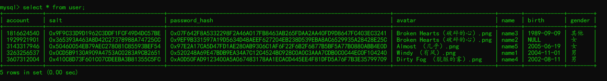
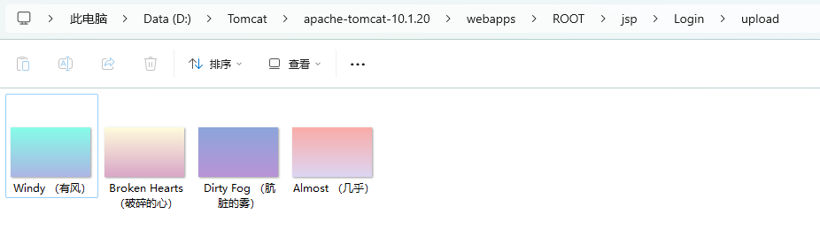

#! https://zhuanlan.zhihu.com/p/701024371
# jsp + servlet 实现登录

本文主要介绍 `jsp + servlet` 如何实现登录功能，主要包括实现响应登录和注册的请求，PBKDF2加密算法对密码进行加密处理，JDBC将注册信息写入数据库。

## 环境

eclipse web - 2024.03  
Tomcat v10.1  
JDK 19  

搭建项目如下：

```text
Login/
    ├─build     # 构建项目时自动生成
    │  └─classes
    │      ├─secure
    │      │      Secure.class
    │      │
    │      ├─servlet
    │      │      LoginServlet.class
    │      │      SignInServlet.class
    │      │
    │      └─user
    │              User$Gender.class
    │              User.class
    │
    ├─src
    │  └─main
    │      ├─java
    │      │  ├─secure
    │      │  │      Secure.java            # 加密和密码校验
    │      │  │
    │      │  ├─servlet
    │      │  │      LoginServlet.java      # 响应登录
    │      │  │      SignInServlet.java     # 响应注册
    │      │  │
    │      │  └─user
    │      │          User.java
    │      │
    │      └─webapp
    │          │  index.jsp     # 登录页面
    │          │  signIn.jsp    # 注册页面
    │          │
    │          ├─META-INF
    │          │   MANIFEST.MF
    │          │
    │          └─WEB-INF
    │              │  web.xml
    │              │
    │              ├─classes
    │              │  ├─secure
    │              │  │      Secure.class
    │              │  │
    │              │  ├─servlet
    │              │  │      LoginServlet.class
    │              │  │      SignInServlet.class
    │              │  │
    │              │  └─user
    │              │          User$Gender.class
    │              │          User.class
    │              │
    │              └─lib
    │                  mysql-connector-j-8.0.32.jar     # JDBC的jar包
    │
    └─upload    # 存储上传的头像
```

搭建项目如上，由于我们不使用包管理工具，因此项目构建时在 `build/` 文件中生成的 `.class` 文件需要手动更新到 `/webapp/WEB-INF/classes` 中，可以使用以下脚本处理，将以下 `.bat` 脚本放在项目根目录 `Login/` 下：

```bat
xcopy .\build\classes\ .\src\main\webapp\WEB-INF\classes\ /E /Y
```

## 页面构建

`index.jsp` 即登录页面：

```html
<%@ page language="java" contentType="text/html; charset=UTF-8" pageEncoding="UTF-8" %>
<!DOCTYPE html>
<html>

    <head>
        <title>登录</title>
        <style>
            .login {
                display: flex;
                justify-content: center;
                align-items: center;
                flex-wrap: wrap;
                flex-direction: column;
                padding: 2vh 2vw;
                margin: 5vh auto;
                width: 20%;
                border: 1px solid #ccc;
                background-color: #f7f7f7
            }

            .login-item {
                margin: 1vh 0;
                display: flex;
                justify-content: center;
                align-items: center;
            }

            label {
                color: rgba(0, 0, 0, 0.5);
            }

            input[type="text"],
            input[type="password"] {
                padding: 0.5vh 0.25vw;
                color: rgba(0, 0, 0, 0.6);
            }

            input[type="submit"],
            .signIn {
                background-color: #fff;
                color: rgba(0, 0, 0, 0.5);
                border: 1px solid #ccc;
                padding: 0.25vh 1vw;
                margin: 0 0.5vw;
                font-family: serif;
                font-size: 1em;
            }

            .signIn {
                text-decoration: none;
            }

            input[type="submit"]:hover,
            .signIn:hover {
                background-color: rgba(0, 0, 0, 0.1);
            }
        </style>
    </head>

    <body>
        <div class="login">
            <form action="LoginServlet" method="POST" target="_blank" autocomplete="on">
                <div class="login-item">
                    <input type="text" name="account" placeholder="账号" maxlength="20" required />
                </div>
                <div class="login-item">
                    <input type="password" name="password" placeholder="密码" minlength="6" required />
                </div>

                <div class="login-item">
                    <input type="submit" value="登录" />
                    <a class="signIn" href="signIn.jsp">注册</a>
                </div>
            </form>
        </div>
    </body>

</html>        
```



`signIn.jsp` 即注册页面：

```html
<%@ page language="java" contentType="text/html; charset=UTF-8" pageEncoding="UTF-8" %>
<!DOCTYPE html>
    <html>

    <head>
        <title>注册</title>
        <style>
            .signIn {
                display: flex;
                justify-content: center;
                align-items: center;
                flex-wrap: wrap;
                flex-direction: column;
                padding: 2vh 2vw;
                margin: 5vh auto;
                width: 20%;
                border: 1px solid #ccc;
                background-color: #f7f7f7
            }

            .signIn-item {
                margin: 1vh 0;
                display: flex;
                justify-content: center;
                align-items: center;
            }

            label {
                color: rgba(0, 0, 0, 0.5);
            }

            .avatar {
                width: 2vw;
                height: 2vw;
                border: 1px solid rgba(0, 0, 0, 0.1);
                border-radius: 50%;
                /* 使用50%可以确保边框是圆形 */
                position: relative;
                /* 设置相对定位 */
                overflow: hidden;
                /* 隐藏input元素的溢出部分 */
                display: flex;
                justify-content: center;
                align-items: center;
                background-size: cover;
                background-position: center;
            }

            input[type="file"] {
                opacity: 0;
                /* 完全透明，不可见 */
                position: absolute;
                /* 绝对定位 */
                width: 100%;
                height: 100%;
                cursor: pointer;
                /* 当鼠标悬停在input上时，显示指针手势 */
            }

            input[type="text"],
            input[type="password"] {
                padding: 0.5vh 0.25vw;
                color: #000;
            }

            input[type="radio"] {
                margin-right: 1.2vw;
            }

            input[type="submit"] {
                color: rgba(0, 0, 0, 0.5);
                border: 1px solid #ccc;
                padding: 0.25vh 0.5vw;
            }

            input[type="submit"]:hover {
                background-color: rgba(0, 0, 0, 0.1);
            }
        </style>
    </head>

    <body>
        <div class="signIn">
            <form action="SignInServlet" method="POST" target="_blank" autocomplete="on" enctype="multipart/form-data">
                <div class="signIn-item">
                    <div class="avatar">
                        <input type="file" id="avatar" name="avatar" accept=".jpeg,.png,.gif" required />
                        <svg t="1717053920559" class="avatarSvg" viewBox="0 0 1024 1024" version="1.1"
                            xmlns="http://www.w3.org/2000/svg" p-id="3152" width="2vw" height="2vw">
                            <path
                                d="M768 733.866667L674.133333 640H392.533333L298.666667 733.866667V810.666667h469.333333v-76.8z m42.666667-17.066667V853.333333H256v-136.533333L375.466667 597.333333h311.466666l123.733334 119.466667z m-85.333334-354.133333c0 106.666667-85.333333 192-192 192S341.333333 469.333333 341.333333 362.666667 426.666667 170.666667 533.333333 170.666667 725.333333 256 725.333333 362.666667z m-42.666666 0C682.666667 281.6 614.4 213.333333 533.333333 213.333333S384 281.6 384 362.666667s68.266667 149.333333 149.333333 149.333333S682.666667 443.733333 682.666667 362.666667z"
                                fill="#bfbfbf" p-id="3153">
                            </path>
                        </svg>
                    </div>
                </div>
                <div class="signIn-item">
                    <input type="text" name="account" placeholder="账号" maxlength="20" required />
                </div>
                <div class="signIn-item">
                    <input type="password" name="password" placeholder="密码" minlength="6" required />
                </div>
                <div class="signIn-item">
                    <input type="text" name="name" placeholder="用户名" />
                </div>
                <div class="signIn-item">
                    <label>日期：</label>
                    <input type="date" name="birth" />
                </div>
                <div class="signIn-item">
                    <label>性别：</label>
                    <label for="male">男</label>
                    <input type="radio" id="male" name="gender" value="男" checked />
                    <label for="female">女</label>
                    <input type="radio" id="female" name="gender" value="女" />
                    <label for="other">其他</label>
                    <input type="radio" id="other" name="gender" value="其他" />
                </div>

                <div class="signIn-item">
                    <input type="submit" value="注册" />
                </div>
            </form>
        </div>
    </body>


    <script>
        document.addEventListener('DOMContentLoaded', function () {
            var avatarInput = document.getElementById('avatar');
            var avatarDiv = document.querySelector('.avatar');
            var avatarSvg = document.querySelector('.avatarSvg');

            avatarInput.addEventListener('change', function (event) {
                var file = event.target.files[0]; // 获取选择的文件
                var reader = new FileReader(); // 创建FileReader对象

                // 检查文件是否是图片
                if (file && file.type.match('image.*')) {//检查file对象的type属性是否以image/开头
                    // 读取文件作为DataURL
                    reader.readAsDataURL(file);
                } else {
                    alert('请选择一个图片文件。');
                }

                reader.onload = function (e) {
                    // 当文件被读取后，将其设置为背景图像
                    avatarDiv.style.backgroundImage = 'url(' + e.target.result + ')';//.result是FileReader对象的一个属性，当使用readAsDataURL方法读取文件时，它包含了文件的DataURL。DataURL是一个URI，它以base64编码包含了图像文件的内容，可以直接在浏览器中使用。
                    avatarSvg.style.display = "none";
                };

                // 可选：添加错误处理
                reader.onerror = function (e) {
                    console.error('读取文件时发生错误:', e);
                    alert('读取文件时发生错误，请重试。');
                };
            });
        });
    </script>

    </html>    
```



## 后端部分

在 MySQL 中创建 `User` 表：

```sql
create table user(
    account varchar(20) comment '帐号',
    salt varbinary(43) not null,
    password_hash varbinary(43) not null,
    avatar varchar(50) comment '头像文件名',
    name varchar(20) comment '用户名',
    birth date comment '出生日期',
    gender enum('男','女','其他') comment '性别',
    primary key(account)
)comment '用户信息表';
```

其中 `salt` 和 `password_hash` 为 `PBKDF2WithHmacSHA256` 加密后的密码信息，此加密方式为单向加密且不可逆的，用二进制形式将加密信息存储。每三个字节转换为4个字节Base64字符，32字节序列需要43字节存储。

头像文件名包括后缀，在存储头像的文件夹 `upload` 中可以访问到这些头像图片，并通过 Base64 编码的方式直接显示这些图片，从而避免了跨域问题。

> 注意这里我采用绝对路径去访问图片是因为 `eclipse` 的服务器配置问题导致无法正常在项目根目录创建 `upload` 文件夹，如果用相对路径访问服务器内的资源就不会产生跨域问题。

用户类 `User.java`

```Java
package user;

import java.sql.Date;

public class User {
    private String account;// 账号
    private String salt;// 加密算法中的salt的Base64编码
    private String password;// 密码哈希的Base64编码
    private String avatar;// 头像文件名
    private String name;// 用户名
    private Date birth;// 出生日期
    private Gender gender;// 性别

    public enum Gender {
        MALE("男"),
        FEMALE("女"),
        OTHER("其他");

        private String gender;

        // 枚举构造器
        Gender(String gender) {
            this.gender = gender;
        }

        // 获取gender属性的方法
        public String getGender() {
            return gender;
        }

        public static Gender getGender(String gender) {
            if (gender != null) {
                if (gender.equals("男"))
                    return Gender.MALE;
                else if (gender.equals("女"))
                    return Gender.FEMALE;
                return Gender.OTHER;
            }
            return null;
        }
    }

    public User(String account, String password) {
        this.account = account;
        this.password = password;
    }

    public User(String account, String password, String avatar, String name, Date birth, Gender gender) {
        this.avatar = avatar;
        this.account = account;
        this.password = password;
        this.name = name;
        this.birth = birth;
        this.gender = gender;
    }

    public String getAvatar() {
        return avatar;
    }

    public String getAccount() {
        return account;
    }

    public String getSalt() {
        return salt;
    }

    public String getPassword() {
        return password;
    }

    public String getName() {
        return name;
    }

    public Date getBirth() {
        return birth;
    }

    public Gender getGender() {
        return gender;
    }

    public void setAvatar(String avatar) {
        this.avatar = avatar;
    }

    public void setAccount(String account) {
        this.account = account;
    }

    public void setSalt(String salt) {
        this.salt = salt;
    }

    public void setPassword(String password) {
        this.password = password;
    }

    public void setName(String name) {
        this.name = name;
    }

    public void setBirth(Date birth) {
        this.birth = birth;
    }

    public void setGender(Gender gender) {
        this.gender = gender;
    }

    public String toString() {
        StringBuilder info = new StringBuilder();
        info.append("Avatar: " + this.avatar + "\n");
        info.append("Account: " + this.account + "\n");
        info.append("Salt: " + this.salt + "\n");
        info.append("Password: " + this.password + "\n");
        info.append("Name: " + ((this.name != null) ? this.name : "null") + "\n");
        info.append("Birth: " + ((this.birth != null) ? this.birth.toString() : "null") + "\n");
        info.append("Gender: " + this.getGender().getGender() + "\n");
        return info.toString();
    }
}
```

`SignInServlet.java` 响应注册请求：

```Java
package servlet;

//省略import部分

@MultipartConfig
@WebServlet("/SignInServlet")
public class SignInServlet extends HttpServlet implements Secure {
    private static final long serialVersionUID = 1L;

    static String uploadDir = "D:\\Tomcat\\apache-tomcat-10.1.20\\webapps\\ROOT\\jsp\\Login\\upload";

    static Connection conn;
    static PreparedStatement ps;

    // 连接数据库
    static {
        try {
            Class.forName("com.mysql.cj.jdbc.Driver");
            conn = DriverManager.getConnection("jdbc:mysql://127.0.0.1:3306/test", "root", "kv");
        } catch (SQLException ex) {
            ex.printStackTrace();
        } catch (ClassNotFoundException ex) {
            ex.printStackTrace();
        }
    }

    @Override
    protected void doGet(HttpServletRequest request, HttpServletResponse response)
            throws ServletException, IOException {
        doPost(request, response);
    }

    @Override
    protected void doPost(HttpServletRequest request, HttpServletResponse response)
            throws ServletException, IOException {
        // 检查请求是否包含多部分数据
        if (!request.getContentType().startsWith("multipart/form-data")) {
            throw new ServletException("请求不是multipart/form-data类型");
        }

        String account = request.getParameter("account");
        String password = request.getParameter("password");
        Part filePart = request.getPart("avatar");// 获取上传的文件部分
        String name = request.getParameter("name");
        String birthString = request.getParameter("birth");
        Gender gender = Gender.getGender(request.getParameter("gender"));

        String avatar = null;
        if (filePart != null)
            avatar = Paths.get(filePart.getSubmittedFileName()).getFileName().toString();// 文件名

        if (name.equals(""))
            name = null;

        java.sql.Date birth = null;
        // 获取出生日期
        if (!birthString.equals("")) {
            try {
                SimpleDateFormat dateFormat = new SimpleDateFormat("yyyy-MM-dd");
                Date utilDate = null;
                utilDate = dateFormat.parse(birthString);
                birth = new java.sql.Date(utilDate.getTime());
            } catch (ParseException e) {// 日期格式不合适
                e.printStackTrace();
            }
        }

        // 创建用户对象并登录
        User user = new User(account, password, avatar, name, birth, gender);

        int status = signIn(user);// 将信息写入数据库
        System.out.println("注册信息：");
        System.out.println(user.toString() + "\n");// 控制台显示注册信息

        response.setCharacterEncoding("UTF-8");
        response.setContentType("text/html; charset=UTF-8");
        PrintWriter out = response.getWriter();
        switch (status) {
            case -1: {// 注册失败
                out.print("<p color=\"red\">注册失败！</p>");
                break;
            }
            case 0: {// 账号已存在
                out.print("<p color=\"green\">账号已存在，请<a href=\"index.jsp\">登录</a></p>");
                break;
            }
            case 1: {// 注册成功
                if (filePart != null) {// 上传头像
                    // 创建upload文件夹
                    File upload = new File(uploadDir);
                    if (!upload.exists())
                        upload.mkdir();

                    // 设置保存文件的路径
                    File uploadFile = new File(uploadDir + "\\" + avatar);

                    // 用输入输出流将文件写入到上传路径中
                    InputStream inputSteam = filePart.getInputStream();
                    try (OutputStream outputStream = new FileOutputStream(uploadFile)) {
                        byte[] buffer = new byte[4096];
                        int bytesRead;
                        while ((bytesRead = inputSteam.read(buffer)) != -1) {
                            outputStream.write(buffer, 0, bytesRead);
                        }
                    }
                }

                out.print("<p style=\"color: green;\">注册成功!</p>");

                // 将图片转化为base64编码
                if (filePart != null) {
                    FileInputStream fis = new FileInputStream(uploadDir + "\\" + user.getAvatar());
                    byte[] bytes = fis.readAllBytes();// 读取全部图片字节数据
                    String base64Image = Base64.getEncoder().encodeToString(bytes);// 将字节数据编码为Base64字符串
                    fis.close();
                    out.print("");
                }

                out.print(
                        "<p>账号：" + user.getAccount() + "</p>" +
                                "<p>盐值：" + user.getSalt() + "</p>" +
                                "<p>密码哈希：" + user.getPassword() + "</p>" +
                                "<p>用户名：" + ((user.getName() != null) ? user.getName() : "null") + "</p>" +
                                "<p>出生日期：" + ((user.getBirth() != null) ? user.getBirth().toString() : "null") + "</p>"
                                +
                                "<p>性别：" + user.getGender().getGender() + "</p>");
                break;
            }
            default:
                throw new IllegalArgumentException("Unexpected value: " + status);
        }
    }

    /**
     * 注册账号
     * 
     * @param user 用户对象
     * @return 0表示已经注册，1表示注册成功，-1表示注册失败
     */
    protected int signIn(User user) {
        ResultSet res = null;
        try {
            // 判断帐号存在
            ps = conn.prepareStatement("select * from user where account=?");
            ps.setString(1, user.getAccount());
            res = ps.executeQuery();
            if (res.next())
                return 0;// 帐号已注册

            // 对密码进行加密
            byte[] salt = generateSalt();
            user.setSalt(Base64.getEncoder().encodeToString(salt));
            byte[] password_hash = hashPassword(user.getPassword(), salt, 10000, 256);
            user.setPassword(Base64.getEncoder().encodeToString(password_hash));

            ps = conn.prepareStatement(
                    "insert into user(account, salt, password_hash, avatar, name, birth, gender) values(?,?,?,?,?,?,?)");
            ps.setString(1, user.getAccount());
            ps.setBytes(2, salt);
            ps.setBytes(3, password_hash);
            ps.setString(4, user.getAvatar());
            ps.setString(5, user.getName());
            ps.setDate(6, user.getBirth());
            ps.setString(7, user.getGender().getGender());
            ps.execute();
            return 1;// 注册成功
        } catch (SQLException ex) {
            ex.printStackTrace();
        } finally {
            try {
                res.close();
                ps.close();
            } catch (SQLException ex) {
                ex.printStackTrace();
            }
        }
        return -1;// 如果发生异常，注册失败
    }
}
```

`LoginServlet.java` 响应登录请求：

```Java
package servlet;

//省略import部分

@WebServlet("/LoginServlet")
public class LoginServlet extends HttpServlet implements Secure {
    private static final long serialVersionUID = 1L;

    static String uploadDir = "D:\\Tomcat\\apache-tomcat-10.1.20\\webapps\\ROOT\\jsp\\Login\\upload";

    static Connection conn;
    static PreparedStatement ps;

    // 连接数据库
    static {
        try {
            Class.forName("com.mysql.cj.jdbc.Driver");
            conn = DriverManager.getConnection("jdbc:mysql://127.0.0.1:3306/test", "root", "kv");
        } catch (SQLException ex) {
            ex.printStackTrace();
        } catch (ClassNotFoundException ex) {
            ex.printStackTrace();
        }
    }

    @Override
    protected void doGet(HttpServletRequest request, HttpServletResponse response)
            throws ServletException, IOException {
        doPost(request, response);
    }

    @Override
    protected void doPost(HttpServletRequest request, HttpServletResponse response)
            throws ServletException, IOException {

        String account = request.getParameter("account");
        String password = request.getParameter("password");

        // 创建用户对象并登录
        User user = new User(account, password);
        int status = login(user);// 用户登录

        PrintWriter out = response.getWriter();
        response.setCharacterEncoding("UTF-8");
        response.setContentType("text/html; charset=UTF-8");
        switch (status) {
            case -1: {// 登录失败
                out.print("<p style=\"color: red;\">登录失败，密码错误！</p>");
                break;
            }
            case 0: {// 需要注册
                out.print("<p style=\"color: red;\">账号不存在，请<a href=\"signIn.jsp\">注册</a></p>");
                break;
            }
            case 1: {// 登录成功
                System.out.println("登录信息：");
                System.out.println(user.toString() + "\n");
                out.print("<p style=\"color: green;\">登录成功</p>");

                // 输出头像
                FileInputStream fis = new FileInputStream(uploadDir + "\\" + user.getAvatar());
                byte[] bytes = fis.readAllBytes();// 读取全部图片字节数据
                String base64Image = Base64.getEncoder().encodeToString(bytes);// 将字节数据编码为Base64字符串
                fis.close();
                out.print("");

                // 输出用户信息
                out.print(
                        "<p>账号：" + user.getAccount() + "</p>" +
                                "<p>盐值：" + user.getSalt() + "</p>" +
                                "<p>密码哈希：" + user.getPassword() + "</p>" +
                                "<p>用户名：" + ((user.getName() != null) ? user.getName() : "null") + "</p>" +
                                "<p>出生日期：" + ((user.getBirth() != null) ? user.getBirth().toString() : "null") + "</p>"
                                +
                                "<p>性别：" + user.getGender().getGender() + "</p>");
                break;
            }
            default:
                throw new IllegalArgumentException("Unexpected value: " + status);
        }
    }

    /**
     * 
     * @param user 用户对象
     * @return 0表示需要注册，1表示登录成功，-1表示登录失败
     * @throws SQLException
     */
    protected int login(User user) {
        ResultSet res = null;
        try {
            ps = conn.prepareStatement("select * from user where account=?");
            ps.setString(1, user.getAccount());
            res = ps.executeQuery();
            if (res.next()) {// 账号存在
                byte[] salt = res.getBytes("salt");
                byte[] password_hash = res.getBytes("password_hash");
                boolean loginSuccessBoolean = verifyPassword(user.getPassword(), password_hash, salt);// 密码校验
                if (!loginSuccessBoolean)
                    return -1;// 密码错误
                else {
                    // 载入用户信息
                    user.setAvatar(res.getString("avatar"));
                    user.setSalt(Base64.getEncoder().encodeToString(salt));
                    user.setPassword(Base64.getEncoder().encodeToString(password_hash));
                    user.setName(res.getString("name"));
                    user.setBirth(res.getDate("birth"));
                    user.setGender(Gender.getGender(res.getString("gender")));
                }
            } else// 账号不存在，需要注册
                return 0;
        } catch (SQLException ex) {
            ex.printStackTrace();
        } finally {
            try {
                res.close();
                ps.close();
            } catch (SQLException ex) {
                ex.printStackTrace();
            }
        }

        return 1;// 登录成功
    }
}
```

## 加密接口实现

`Secure` 接口实现加密的公共方法，在 `LoginServlet` 和 `SignInServlet` 中 implements 此接口即可调用接口中的方法。

```Java
package secure;

import java.security.MessageDigest;
import java.security.SecureRandom;
import java.util.Arrays;

import javax.crypto.SecretKeyFactory;
import javax.crypto.spec.PBEKeySpec;

public interface Secure {
    /**
     * 生成salt,使用VARBINARY(43)存储,每三个字节转换为4个字节Base64字符
     * 
     * @return 16字节的字节数组
     */
    public default byte[] generateSalt() {
        SecureRandom random = new SecureRandom();
        byte[] salt = new byte[16];
        random.nextBytes(salt);
        return salt;
    }

    /**
     * 使用PBKDF2散列密码
     * 
     * @param password   需要被散列的原始密码字符串
     * @param salt       密码散列过程的盐值salt
     * @param iterations 散列算法迭代的次数
     * @param keyLength  生成密钥的位数长度
     * @return 32字节序列
     */

    public default byte[] hashPassword(String password, byte[] salt, int iterations, int keyLength) {
        try {
            PBEKeySpec spec = new PBEKeySpec(password.toCharArray(), salt, iterations, keyLength);
            Arrays.fill(password.toCharArray(), '0'); // 清除密码字符串，避免内存泄露
            SecretKeyFactory factory = SecretKeyFactory.getInstance("PBKDF2WithHmacSHA256");
            byte[] hash = factory.generateSecret(spec).getEncoded();
            return hash;
        } catch (Exception e) {
            throw new RuntimeException("Error while hashing password", e);
        }
    }

    public default boolean verifyPassword(String inputPassword, byte[] storedHashBytes, byte[] storedSaltBytes) {
        try {
            byte[] inputHash = hashPassword(inputPassword, storedSaltBytes, 10000, 256);
            return MessageDigest.isEqual(inputHash, storedHashBytes);
        } catch (Exception e) {
            throw new RuntimeException("Error while verifying password", e);
        }
    }
}
```

## 实现效果









